```{r setup, include=FALSE}
knitr::opts_chunk$set(echo = TRUE)

##change below to the current working directory on your machine

basedir <- file.path("~/Box Sync/psy-597-sem-sp2019/02_sem_basics/onyx_tutorial/") #iMac
# basedir <- file.path("~/Box/psy-597-sem-sp2019/02_sem_basics/onyx_tutorial/") #mbp
setwd(basedir)

library(dplyr)
library(lavaan)
library(jtools)

####not that the above can be accomplished using 
#pacman::p_load(dplyr, lavaan, jtools)
```

This tutorial is meant to walkthrough how Ωnyx allows users to walk through conceptual path models (visual) and convert them on the fly into `lavaan` code for analysis.

#Download Instructions:

* Ωnyx is freely available for download [here.](http://onyx.brandmaier.de/)

* You will need [Java Runtime Environment](https://java.com/en/download/manual.jsp) installed in order to run Ωnyx. 

* Ωnyx is not installed but is simply opened using Java, so just double click on the .jar file to open the program.

#The Basics: 

* Ωnyx is almost entirely graphically based and relies on point-and-click methods.  Start by opening some data.  Open the Ωnyx menu at the top left and navigate to the Simple Regression Data to begin:

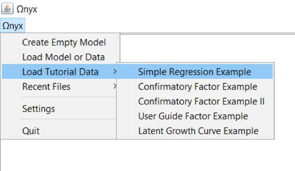

* You’ll see a hexagon appear.  This represents a dataset and includes 3 vectors: ID, X_c, and Y_c, the latter of which are two centered continuous variables:  

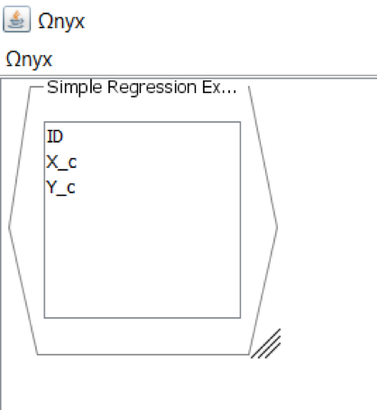

* Double-click in the blank space or right(ctrl) click and select “Create Empty Model” to create a space for your path diagram:

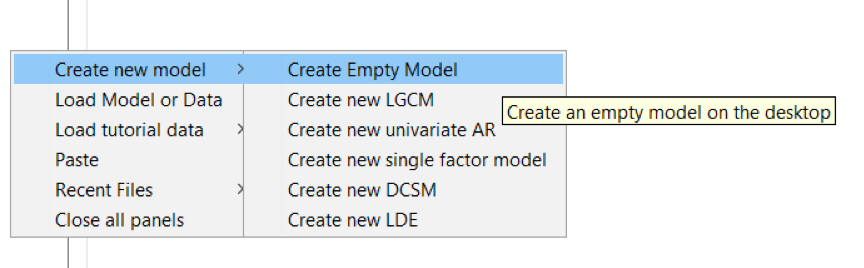

* By right(ctrl) clicking in the model space, you will open a window from which you can build your model.  Try creating two observed variables for your X and Y vectors from the dataset you opened earlier:

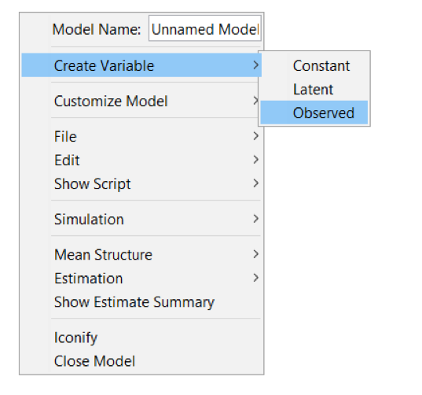

* Connect these variables with a regression line by right(ctrl) clicking and dragging the arrow that appears from one box to the other:

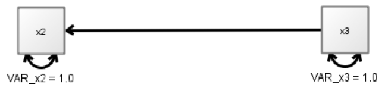

* You’ve now created the visual representation of your first regression model!  Now, add the data to the appropriate boxes by dragging the variables from the data hexagon to the boxes.  You’ll notice that the variable names change in the boxes and actual variance estimates are now generated, based on the raw data:

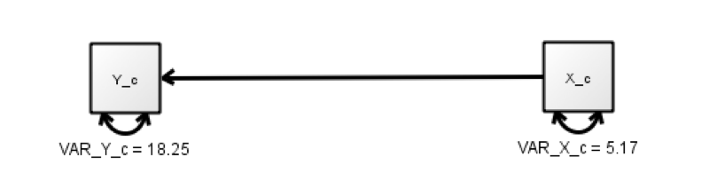

* Finally, allow the regression path to be freely estimated by right(ctrl) clicking on the regression line and selecting “Free Parameter”:


* You’ll notice there is now an unstandardized b weight being estimated for the regression of Y_c onto X_c.  You can also add the standardized weights by selecting “Show Standardized Estimates” under the “Customize Path” dialog:

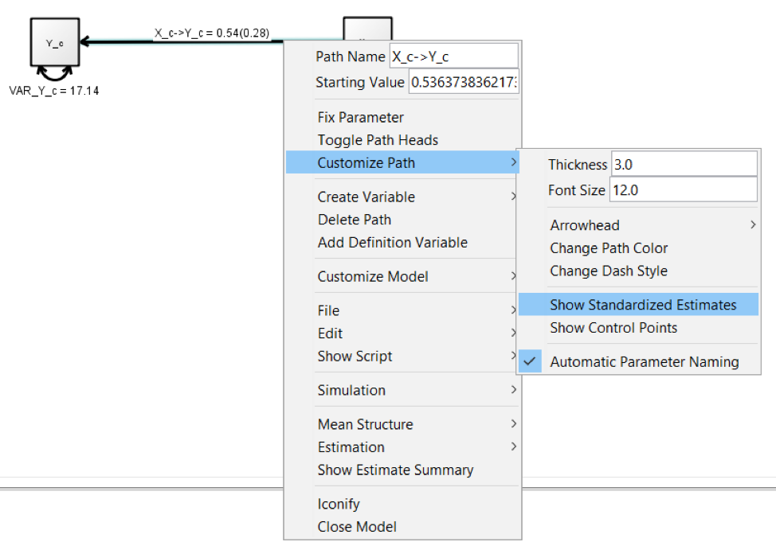

* We can also clean up the variable names in the boxes or for the paths/variances if we want, change the colors, etc. all in the right(ctrl) click dialog box.

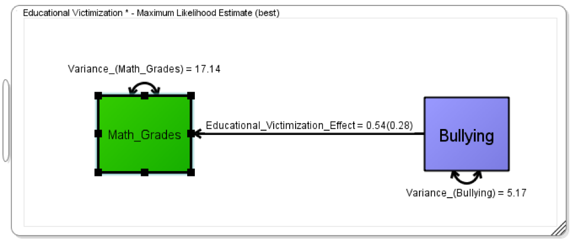

* One final helpful trick is to pull the underlying code (e.g., lavaan code) and/or the covariance matrix from the model you just developed.  Notice Ωnyx generates lavaan code that is used with the lavaan() function (rather than the cfa() function), which requires specifying of all relevant parameters (e.g., variances) and is more useful for learning what’s going on with your code:

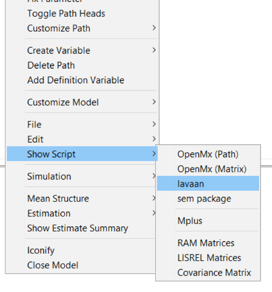
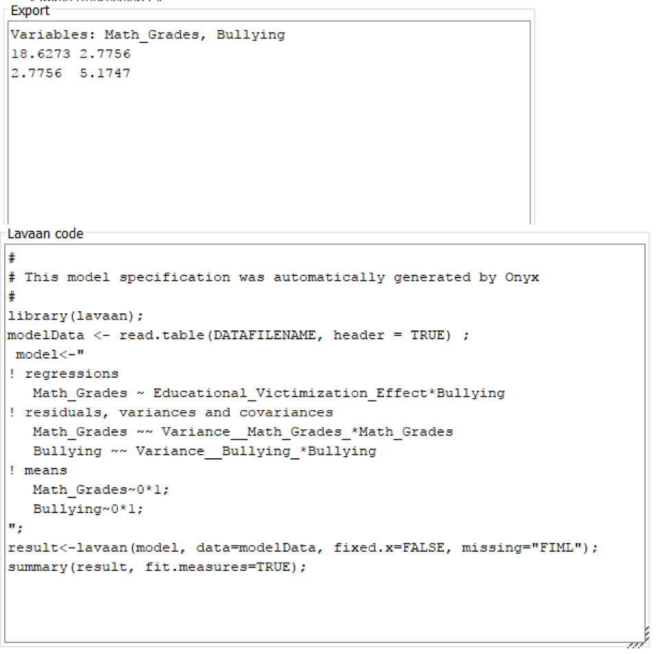

*we can run the exact same analysis using the simple linear model syntax from the `lm()` function. Start with loading data from the example: 

```{r onyx single predictor}
simple.dat <- read.csv("simple_regression_data.csv", header = TRUE, sep = "\t")
str(simple.dat)
simple.lm <- lm(Y_c~X_c, data = simple.dat)
summ(simple.lm)
summary(simple.lm)
```
\n
Now, let's load the model we generated in Ωnyx (named differently from an earlier iteration, but the idea is the same):

```{r lavaan single predictor}
source("single_predictor_data.R")

###contains the lavaan script:
#  model<-"
# ! regressions 
#    Child_IQ ~ Parent_IQ__Child_IQ*Parent_IQ
# ! residuals, variances and covariances
#    Parent_IQ ~~ VAR_Parent_IQ*Parent_IQ
#    Child_IQ ~~ VAR_Child_IQ*Child_IQ
# ! observed means
#    Parent_IQ~1;
#    Child_IQ~1;
# ";

```

#Now, let's expand to multiple regression:

In Ωnyx:

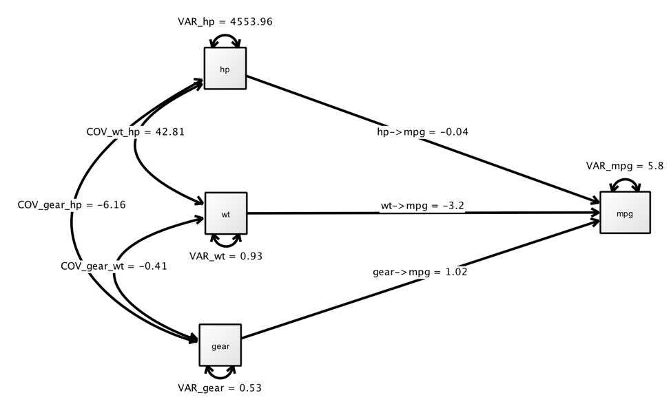

```{r example}
data(mtcars)
# write.csv(mtcars, file = "mtcars.csv")

lm(mpg~hp+wt+gear,mtcars) %>% summ()
lm(mpg~hp+wt+gear,mtcars) %>% vcov()

```


```{r onyx}
#
# This model specification was automatically generated by Onyx
#

 model<-"
! regressions 
   mpg ~ gear__mpg*gear
   mpg ~ wt__mpg*wt
   mpg ~ hp__mpg*hp
! residuals, variances and covariances
   mpg ~~ VAR_mpg*mpg
   hp ~~ VAR_hp*hp
   wt ~~ VAR_wt*wt
   gear ~~ VAR_gear*gear
   wt ~~ COV_wt_hp*hp
   gear ~~ COV_gear_wt*wt
   gear ~~ COV_gear_hp*hp
! observed means
   mpg~1;
   hp~1;
   wt~1;
   gear~1;
";


result<-lavaan(model, data=mtcars, fixed.x=FALSE, missing="FIML");
summary(result, fit.measures=TRUE);
inspect(result, "list")

```

* Running the same model with much less input gives us the same result:

```{r onyx_cf}
model2<-'
mpg~hp+wt+gear
'
result2<-cfa(model2,data=mtcars, fixed.x = F,missing="FIML")
summary(result2,fit.measures=T)
inspect(result2,"list")
```

#One step more complicated, a simple single-factor CFA:

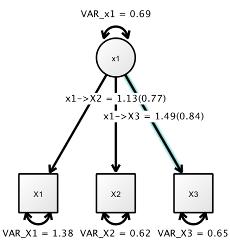

```{r onyx_cfa}

cfa_dat<-read.csv("CFA_data.csv",head=T)
#
# This model specification was automatically generated by Onyx:
 model<-"
! regressions 
   x1=~1.0*X1   ##fixing loadings makes fit worse but more on this later
   x1=~1.0*X2
   x1=~1.0*X3
! residuals, variances and covariances
   X1 ~~ VAR_X1*X1
   X2 ~~ VAR_X2*X2
   X3 ~~ VAR_X3*X3
   x1 ~~ VAR_x1*x1
! observed means
   X1~1;
   X2~1;
   X3~1;
";
result<-lavaan(model, data=cfa_dat, fixed.x=FALSE, missing="FIML");
summary(result, fit.measures=TRUE);


 model_free<-"
! regressions 
   x1=~1.0*X1
   x1=~x1__X2*X2
   x1=~x1__X3*X3
! residuals, variances and covariances
   X1 ~~ VAR_X1*X1
   X2 ~~ VAR_X2*X2
   X3 ~~ VAR_X3*X3
   x1 ~~ VAR_x1*x1
! observed means
   X1~1;
   X2~1;
   X3~1;
";
result_free<-lavaan(model_free, data=cfa_dat, fixed.x=FALSE, missing="FIML");
summary(result, fit.measures=TRUE);

inspect(result_free, "std") #gives loadings (see standardized estimates on word doc)
```


