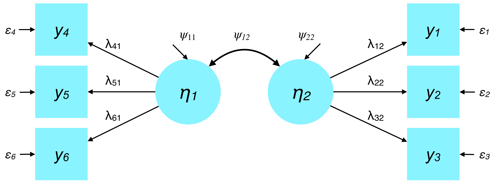

<style type="text/css">
body{ font-size: 24px; max-width: 1600px; margin: auto; padding: 1em; }
code.r{ font-size: 20px; }
p { padding-top: 8px; padding-bottom: 8px; }
pre { font-size: 16px; }
</style>


```{r setup, include=FALSE}
if (!require(pacman)) { install.packages("pacman"); library(pacman) }
p_load(knitr, tidyverse, lavaan, modelr, mlbench, lattice, lm.beta, semPlot, DiagrammeR, matrixcalc)
knitr::opts_chunk$set(echo = TRUE) #print code by default
options(digits=3) 
```

(Thanks to Aidan Wright for some of the content below.)

# Goal of SEM

The overarching goal of SEM is to test how well a model of covariance among variables matches the observed data.

## Notational reminders

- Sample covariance matrix: $\mathbf{S_{XX}}$

- Model-implied covariance matrix: $\mathbf{\Sigma}(\hat{\mathbf{\theta}})$.

## Conceptualizing fit in SEM

Testing a model of covariance is accomplished by minimizing the *discrepancy* between a predictions from a hypothesized model and the observed data, then comparing the discrepancy to a threshold. The model is said to 'fit' if the discrepancy is reasonably small. We'll return to the topic of quantifying fit in future weeks.

The term $\hat{\mathbf{\theta}}$ refers to the vector of estimated (free) parameters that constitutes the SEM. In other words, the model-implied covariance matrix is a joint function of all free parameters in the model. As we'll see, these parameters are distributed across conceptually distinct matrices.

Thus, the goal of SEM is similar to OLS (ordinary least squares) regression. Both seek to minimize the discrepancy between the model prediction and the observed data.

In SEM, instead of minimizing $(Y - \hat{Y})^2$, we are trying to minimize discrepancies between the model-implied and observed covariance matrices: $\mathbf{S_{XX}}$ and $\mathbf{\Sigma}(\hat{\mathbf{\theta}})$.

# Five ways to represent a model

1. Written summaries (i.e., in sentence form)
2. Diagrams
3. Regression equations
4. Matrix notation
5. Statistical package code (e.g., lavaan, Mplus)

# Accurate notation

- Providing a full specification, whether graphical or in equations, is crucial.

- Consider this your contract with the reader. It tells the reader what model you ran and is essential to reproducing and assessing your work.

- It is also essential that different representations such as diagrams and equations are consistent with each other.

# Endogenous versus exogenous

Endogenous variable have at least one cause (predictor) in the model. That is, their values *depend* on something that is explicitly modeled.

Exogenous variables are not explained by the model (i.e., unknown causes), but can serve as predictors of endogenous variables.

```{r}
grViz("digraph DAG {

graph [bgcolor=transparent, layout=dot, overlap=false]

node [shape = box, fontcolor=gray25 color=gray80]

node [fontname='Helvetica']
CBT [label='CBT', xlabel='Exogenous'];
Rumination [label='Rumination', xlabel='Endogenous']; 
Dep_Sev [label='Depression Severity', xlabel='Endogenous'];

CBT -> Rumination; Rumination -> Dep_Sev;

}")
```

# Free, fixed, and constrained parameters

- Free parameters are estimated by the model based on the data. That is, they are estimated by fitting the model to the data to achieve a fit criterion (e.g., minimizing the sum of squared errors in OLS regression). Different parameter estimates are 'auditioned' to see which one best fits the data. For example, conceptually speaking, regression considers many different slopes that describe the $X \rightarrow Y$ relationship, choosing the one that best fits the bivariate data according to an OLS criterion.

- Fixed parameters are constants, often specified by you (the scientist).

- Constrained parameters specify a required relationship between two variables. For example, $x = 2y$. In an SEM context, one could require that two factor loadings are equal, which could test the hypothesis that both indicators have an equal association with the latent construct of interest.

# Model representations

## Written summaries

We hypothesize that there are two major latent dimensions of daily mood, Positive Affect and Negative Affect. Positive Affect will be reflected in self-reported responses to mood items including Happy, Cheerful, and Excited. Negative Affect will be reflected in ratings of Lonely, Sad, and Blue.  These latent factors are presumed to account for the majority of variance in each of the items, and Negative Affect and Positive Affect are hypothesized to be modestly correlated.

## Diagrams

The model described above would commonly be depicted as follows:


### RAM notation

Here is a summary of symbols that are commonly used in SEM notation. Note that this builds especially on so-called RAM path notation (McArdle).


### Simplified RAM notation

For simplicity, we can remove the distinction between exogenous variances and endogenous disturbances using a single inward-pointing arrow to denote both constructs:


## Equations

### LISREL all-y notation

In this class, we will typically adopt the 'all-y' LISREL notation in which the parameter matrices do not distinguish between exogenous and endogenous variables.

- $\mathbf{y}_i$: A vector of observed values for the *i*th variable.
- $\boldsymbol{\eta}_i$: A vector of estimated values of the *i*th latent variable. These are also referred to as factor scores.
- $\boldsymbol{\Lambda}_y$ or $\lambda_{1,1}$: Factor loadings of the observed variables $\mathbf{Y}$ onto factors $\boldsymbol{\eta}$. Also conceptualized as regression slopes (observed regressed on latent). Note that if expressed by specific subscripts (e.g., $\lambda_{1,1}$), the first subscript is the observed variable ($y_{1...j}$) and the second subscript is the factor ($\eta_{1...k}$). Thus, $\mathbf{\Lambda}$ is $j \times k$ in size.
- $\mathbf{\Theta_\varepsilon}$ or $\mathbf{\varepsilon}_i$: The variance-covariance matrix for all observed variables. Also includes covariances among errors. The diagonal will contain error variances for endogenous observed variables.
- $\boldsymbol{\zeta}_i$: vector of disturbances in endogenous variables (i.e., residual variability due to unmeasured causes).
- $\boldsymbol{\Psi}$: covariance matrix among latent variables. Note that the disturbances for endogenous variables fall along the diagonal.
- $\mathbf{B}$: The matrix of regression coefficients.

### Lavaan matrix naming conventions

In `lavaan`, the names of these parameter matrices largely follow the LISREL all-y notation.

- **lambda**: Factor loadings
- **theta**: (residual) variance-covariance matrix of observed dependent variables
- **psi**: variance-covariance matrix of latent variables
- **beta**: regression coefficients (structural model)
- **nu**: Intercepts/means of observed dependent variables (i.e., y's) -- only if mean structure is modeled
- **alpha**: latent means (or intercepts) -- only if mean structure is modeled

## Walking between equations and diagrams

The elements of each matrix in a given SEM can be depicted in diagrams to clarify the relationships between the parameter matrices and the graphical model representation.

For example:



Furthermore, by overlaying parameters onto the diagrams, we can develop a clearer intuition of how the model represents a set of regression equations.

$$
\begin{align*}
\boldsymbol{y}_1 &= \lambda_{12} \boldsymbol{\eta}_2 + \boldsymbol{\varepsilon}_1 \\
\boldsymbol{y}_2 &= \lambda_{22} \boldsymbol{\eta}_2 + \boldsymbol{\varepsilon}_2 \\
\boldsymbol{y}_3 &= \lambda_{32} \boldsymbol{\eta}_2 + \boldsymbol{\varepsilon}_3 \\
\boldsymbol{y}_4 &= \lambda_{41} \boldsymbol{\eta}_1 + \boldsymbol{\varepsilon}_4 \\
\boldsymbol{y}_5 &= \lambda_{51} \boldsymbol{\eta}_1 + \boldsymbol{\varepsilon}_5 \\
\boldsymbol{y}_6 &= \lambda_{61} \boldsymbol{\eta}_1 + \boldsymbol{\varepsilon}_6
\end{align*}
$$

## Matrix notation

Matrix notation provides a compact way to express structural equation models. This notation is also closest to what really happens between specifying a model conceptually and obtaining a model-implied covariance matrix, which is the primary 'output' of a SEM.

We can walk between equation form and matrix form by recalling that our regression equations can be reexpressed in terms of the SEM matrices mentioned above (e.g., $\boldsymbol{\Lambda}$). For clarity, I have reexpressed the equations in terms of the model's prediction for a given subject $s$. Also note that I've dropped the 'hats' from the $y$ variables for simplicity.

$$
\begin{align*}
y_{1,s} &= \lambda_{12} \eta_{2,s} + \varepsilon_{1,s} \\
y_{2,s} &= \lambda_{22} \eta_{2,s} + \varepsilon_{2,s} \\
y_{3,s} &= \lambda_{32} \eta_{2,s} + \varepsilon_{3,s} \\
y_{4,s} &= \lambda_{41} \eta_{1,s} + \varepsilon_{4,s} \\
y_{5,s} &= \lambda_{51} \eta_{1,s} + \varepsilon_{5,s} \\
y_{6,s} &= \lambda_{61} \eta_{1,s} + \varepsilon_{6,s}
\end{align*} \Longrightarrow
\begin{bmatrix}
y_{1,s} \\
y_{2,s} \\
y_{3,s} \\
y_{4,s} \\
y_{5,s} \\
y_{6,s}
\end{bmatrix} =
\begin{bmatrix}
0 & \lambda_{12} \\
0 & \lambda_{22} \\
0 & \lambda_{32} \\
\lambda_{41} & 0 \\
\lambda_{51} & 0 \\
\lambda_{61} & 0
\end{bmatrix}
\begin{bmatrix}
\eta_{1,s} \\
\eta_{2,s}
\end{bmatrix} +
\begin{bmatrix}
\varepsilon_{1,s} \\
\varepsilon_{2,s} \\
\varepsilon_{3,s} \\
\varepsilon_{4,s} \\
\varepsilon_{5,s} \\
\varepsilon_{6,s}
\end{bmatrix}
$$

Even more compact, we can distill the notation above into a single matrix equation for the predicted scores of an individual $s$ on all $y$ variables:

$$
\boldsymbol{y}_s = \boldsymbol{\Lambda}_y \boldsymbol{\eta}_s + \boldsymbol{\varepsilon}_s
$$

### Similarities to regression equations

Note that our model-predicted scores on all $y$ for a given individual $s$ do not have an expectation of the value when the factor scores, $\boldsymbol{\eta}$, are zero. This corresponds to the default 'vanilla' SEM where the means are not explicitly part of the model representation. Rather, the model is only tasked with explaining the sample variance-covariance matrix, $\mathbf{S_{XX}}$.

As we'll return to later, we can add mean structure to the model. For example, the $\boldsymbol{\nu}$ vector captures the intercepts for observed endogenous variables such as indicators of a factor.

$$
\begin{align*}
\textrm{No means:} \quad & \boldsymbol{y}_s = \boldsymbol{\Lambda}_y \boldsymbol{\eta}_s + \boldsymbol{\varepsilon}_s \\
\textrm{Means:} \quad & \boldsymbol{y}_s = \boldsymbol{\nu}_y + \boldsymbol{\Lambda}_y \boldsymbol{\eta}_s + \boldsymbol{\varepsilon}_s \\
\textrm{Univariate regression:} \quad & y_{i,s} = \beta_{0,i} + \beta_{1,i} x_{i,s} + \varepsilon_{i,s}
\end{align*}
$$

## Statistical package code

Likewise, in lavaan, we can write out a model string that specifies all key equations that define a given SEM:

```
mstring <- '
NA =~ Lone + Sad + Blue
PA =~ Hap + Cheer + Excit

NA ~~ PA
NA ~~ NA
PA ~~ PA
'
```

The model specification is now stored in a string variable, `mstring`. This string and the dataset to be fit can then be handed off to a `lavaan` function, usually `sem`, to fit the specified model to the data:

```
my_fitted_model <- sem(mstring, data=my_dataset)
```

