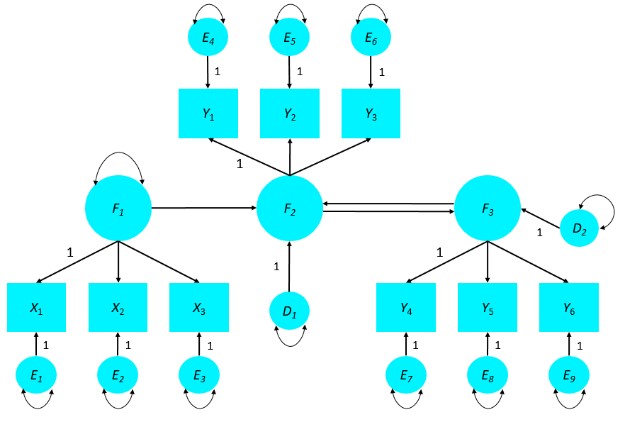

<style type="text/css">
body{ font-size: 24px; max-width: 1600px; margin: auto; padding: 1em; }
code.r{ font-size: 20px; }
p { padding-top: 8px; padding-bottom: 8px; }
pre { font-size: 16px; }
</style>


```{r setup, include=FALSE}
if (!require(pacman)) { install.packages("pacman"); library(pacman) }
p_load(knitr, MASS, tidyverse, viridis, lavaan, modelr, mlbench, lattice, lm.beta, semPlot, DiagrammeR, matrixcalc)
knitr::opts_chunk$set(echo = TRUE) #print code by default
options(digits=3) 
```

# Overview of full SEM

Full SEM contains both a **measurement** component and a **structural** component.  The measurement component is a form of *factor analysis* in which the researcher determines how one or more latent variables map onto the observed variables (i.e., the *indicators*). The structural component is a form of *regression* (as in path analyses) in which certain variables predict other *endogenous* variables, representing an association or causal process. If a variable is not predicted by any other variable (latent or observed) in the model, it is called *exogenous*. Thus, exogenous variables are not assumed to follow a normal distribution or to be multivariate normal with other elements of the covariance matrix. 

In a model containing both measurement and structural components (aka 'full SEM'), the structural component often reflects relationships among the latent variables defined by the measurement component of the model. For example, in this hierarchical factor model, the structural component captures the prediction of job performance by pathological narcissism.

```{r}
grViz("
digraph narc {

  # a 'graph' statement
  graph [overlap = true, fontsize = 12]

  # nodes for observed and latent
  node [shape = circle, fontname = Helvetica]
  'Narcissistic\nGrandiosity'; 'Narcissistic\nVulnerability';
  {rank=same; 'Pathological\nNarcissism'; 'Job\nPerformance';}

  node [shape = box, fontname = Helvetica]
  i1; i2; i3; i4; i5; i6; j1; j2; j3;

  # edges
  'Pathological\nNarcissism'->'Narcissistic\nGrandiosity' 'Pathological\nNarcissism'->'Narcissistic\nVulnerability'
  'Narcissistic\nGrandiosity'->'i1' 'Narcissistic\nGrandiosity'->'i2' 'Narcissistic\nGrandiosity'->'i3'
  'Narcissistic\nVulnerability'->'i4' 'Narcissistic\nVulnerability'->'i5' 'Narcissistic\nVulnerability'->'i6'
  'Job\nPerformance'->'j1' 'Job\nPerformance'->'j2' 'Job\nPerformance'->'j3'
  'Pathological\nNarcissism'->'Job\nPerformance'
}")
```

Notice how from a certain perspective, job performance looks like another indicator of pathological narcissism, alongside grandiosity and vulnerability. This highlights an important point that there is not a strict separation in the maths between measurement and structural models. At times, this separation will be clear, as in the case of the $\boldsymbol{\Lambda}_y$ matrix mapping between observed variables and their corresponding latent variables. In other cases, such as the diagram above, a variable's role (measurement versus structural) is a conceptual, but not mathematical, distinction. Here, job performance is a hypothesized outcome of narcissism, but it is nevertheless parameterized the same as the indicators of narcissism (grandiosity and vulnerability).

# Identification reminders

Recall that identification is broadly concerned with the question of whether we have enough information to solve for unknown model parameters. From Kenny 2012, "In most SEMs, the amount of known information for estimation is the number of elements in the observed variance–covariance matrix." Thus, we can return to the equation for the number of 'observations' (i.e., unique elements) in the sample covariance matrix:

$$
p = \frac{k(k+1)}{2}
$$

For example, a covariance matrix with 7 variables would have 28 pieces of known information: 7 variances and 21 covariances. By the way, notice that the number of unique covariance estimates in a matrix is: $k(k-1)/2$.

Thus, the upper limit of our model's complexity is bounded by the amount of information -- specifically, the number of observations. 

## Model degrees of freedom

The number of free parameters in a SEM is denoted $q$, and the degrees of freedom for the overall model is the difference between $p$ and $q$:

$$ df_\textrm{M} = p - q $$

Thus, as we've discussed, the goal is to develop a parsimonious model with fewer free parameters than observations (covariance values). If two models fit the data equally well, the model with more degrees of freedom should be preferred as more parsimonious. We will return to this issue when considering relative model evidence.

## Overidentified

A model with $df_\textrm{M} > 0$ is called *overidentified*, meaning that there are more equations than unknowns. Thus, there are many parameter sets one could test, and all will be imperfect. Given a model parameterization (i.e., what matrices are included and what the free parameters are), the goal is to identify parameters that best fit the data. In an overidentified model, the idea is to adjudicate among parameter values based on a fit criterion. In SEM, this is usually the sample likelihood function, as mentioned above.

## Underidentified

A model with $df_\textrm{M} < 0$ is called *underidentified*, meaning that there are too man unknown parameters to solve for and no way to solve the equations.

$$ a + b = 6 $$

There are an infinite number of values for $a$ and $b$ that would solve this equation.

## Just-identified

A model with $df_\textrm{M} = 0$ is called *just-identified*, and by definition, it will fit the data perfectly. The idea is that there is one set of parameters in a just-identified model that reproduces the covariance matrix. But there are many alternative just-identified models one could test in a given dataset, but all fit the data equally well, making hypothesis testing difficult.

# The measurement model

As we discussed last week, EFA is a data-driven procedure in which one or more factors load onto all observed variables. One typical goal of an EFA is to achieve simple structure -- that is, in multi-factor models, every indicator has one prominent loading and low cross-loadings. However, this is achieved by rotational methods, not by the scientist intervening to provide input on how factors are reflected in observed indicators. Likewise, deciding on the number of factors underlying the observed data is often informed by features of the data such as the eigenvalues of the correlation matrix.

By contrast, CFA is a more hypothesis-driven approach in which one tests how well a hypothesized measurement model fit the observed covariance matrix. This means *you* specify how many latent variables explain the covariance among your observed variables. And you decide specifically which indicators are caused by which factors. This point illustrates that CFA -- and SEM more generally -- emphasizes *model comparison* as a critical step in model validation. That is, one should always test other plausible models and examine whether they fit the data even better than the initial or preferred model.

## Identification: measurement model

### Minimum number of indicators

In CFA, the number of free parameters you can estimate depends on the number of observations (typically, unique elements in the covariance matrix), just as in any other SEM. We are typically only interested in *overidentified* models where there $df_\textrm{M} > 0$ since this is both more parsimonious than a saturated model (where all covariances are uniquely estimated) and allow for tests of global model fit. In CFA, we can derive the following rule (Kline Rule 9.1, p. 201) to determine the minimum number of indicators we need per factor:

**Rule 9.1**
<p>
1. 3+ indicators are necessary for a factor in a model with one factor.
2. 2+ indicators are necessary for each factor in a model with two or more factors.

However, it is worth noting that these requirements only determine if a model is technically *identified*.  There may be other problems that arise in model estimation if the indicator-per-factor ratio is low, especially with small samples.  Thus, Kenny (1979, p. 143) humorously recommends the following:

"Two *might* be fine, three is better, four is best, and anything more is gravy."

### Scaling

Furthermore, in CFA there is a requirement that *every latent variable must be scaled*, including the error terms, which we consider to be latent (but unmeasured) contributors to our indicators.  Scaling is necessary because latent variables are unmeasured and therefore do not have any innate scale, unlike manifest variables (e.g., a Likert scale from 1-5). Moreover, if all loadings are estimated and the variance of a factor is also estimated, the model will generally be underidentified. Hence, this is not an optional step!

There are two ways to scale factors in CFA.  

1. **Unit loading identification (ULI) constraint**: Fixing the loading of one indicator on each factor to 1. 
2. **Unit variance identification (UVI) constraint**: Fixing the variance of each factor to 1.

**ULI** requires picking an indicator for each latent factor whose loading is fixed to 1. In most statistical packages, including lavaan, ULI is typically implemented by default unless the researcher indicates otherwise. Furthermore, the default is usually to pick the first indicator in the factor specification for the fixed loading ($\lambda_y1 = 1$).  This is the case in lavaan.

For instance, in the following case, the loading of $y_1$ will be fixed to 1 when analyzed: 

```F1 =~ y1 + y2 + y3```

Generally, model fit and parameter estimates will not differ regardless of which indicator is selected to be constrained in an SEM when using ULI.  One can compare this process to centering a vector of data around different numbers: the relationship among the data will not change regardless of which value is made zero.  


<p>
<center></center>

A potential issue with using ULI for scaling may occur if the reliability of indicators of a factor vary widely.  When all indicators have similar reliability, any can be selected as the reference indicator ($\lambda_y = 1$).

Using **UVI** standardizes a latent variable by fixing its variance to 1, which may provide the advantage of simplicity (e.g., using z-scores instead of undstandardized predictors in a regression model).  However, UVI is generally only applicable to *exogenous* variables as the variance terms of endogenous variables are *freely estimated* as disturbances in an SEM and cannot be constrained. While in a model with no structural component (e.g., CFA) this is not an issue, full SEM models may require using ULI rather than UVI for endogenous variables.  Furthermore, using UVI in SEM with multiple groups with significantly different factor variance estimates, or in longitudinal analyses where variances change over time, will result in a lost of potentially meaningful information.  
Notably, the scaling requirement to constrain either factor loadings or variances to 1 reduces the number of freely estimated parameters in a CFA model.  

## Examples of CFA identication

We can see in the following examples (drawn from Kline figure 9.5, p. 202) how to evaluate the identification status of various models and confirm the minimum indicators rule outlined above.

Which of these models is/are identified?  How many degrees of freedom in each model (i.e., # variance/covariance units minus # of parameters estimated)?<font size="+1">*(Remember, you can calculate the number of variance/covariance units available as $k(k+1)/2$, where k = the number of indicators in your model).*</font>

<center>Figure 9.5a</center>
<center></center>

Or with UVI instead of ULI... 

<center></center>
<p><p><p><p>

<center>Figure 9.5b</center>
<center></center>
<p><p><p><p>

<center>Figure 9.5c</center>
<center></center>
<p><p>
<font size="-4"><center>(for answers, click on "Code") &rarr; </center></font>
```{r}
#9.5a: Underidentified (3 variances/covariances - 4 free parameters = -1 df)

#9.5b: Just identified (6 variances/covariances - 6 free parameters = 0 df)

#9.5c: Overidentified (10 variances/covariances - 9 free parameters = 1 df)
```


<center></center>

## Nonstandard CFA

So far, each of the CFA models we have been looking at are considered *standard* CFA models: that is, they each have followed the following two conventions:

1. No correlations among errors of the indicators (local/conditional independence)
2. No indicator loads on more than one factor (simple structure)

However, often we will want to consider *nonstandard* CFA models that may include correlated indicator errors and/or "complex indicators" (i.e., those that load onto multiple factors).  Identification of such models changes slightly from our rules above (9.1) as we now have added additional parameters to estimate in our model.  

### Correlated errors

We can consider the following rules to apply in the case of **correlated errors** (Kline, p. 203):

**Rule 9.2**
<p>
1. For *each factor*, at least one of the following must be true:
      1) There are at least **three** indicators whose errors are uncorrelated.
      2) There are at least **two** indicators whose errors are uncorrelated *and either*:
        (*A*)   these errors are uncorrelated with at least one indicator of another (correlated) factor, or
        (*B*)   the loadings of these indicators are constrained to be equal.
  
2. For *every pair of factors*, there are at least two indicators (one from each factor) with uncorrelated errors.

3. For *every indicator*, there is at least one other indicator anywhere in the model with an uncorrelated error term.

Evaluate the following figures:  Which are identified based on Rule 9.2?  Why?

<center>Figure 9.6a</center>
<center></center>
<p><p><p><p>

<center>Figure 9.6b</center>
<center></center>
<p><p><p><p>

<center>Figure 9.6c</center>
<center></center>
<p><p><p><p>

<center>Figure 9.6d</center>
<center></center>
<p><p><p><p>

<center>Figure 9.6e</center>
<center></center>


<font size="-4"><center>(for answers, click on "Code") &rarr; </center></font>
```{r}
#9.6a: Just identified (10 variances/covariances - 10 free parameters = 0 df; Rule 9.2.1.1 is satisfied in that there are at least three indicators whose errors are uncorrelated and Rule 9.2.3 is satisfied in that every indicator has at least one other indicator with an uncorrelated error term)

#9.6b: Not identified (10 variances/covariances - 10 free parameters = 0 df; BUT Rule 9.2.1.1 is NOT satisfied as there are not three indicators whose errors are uncorrelated)

#9.6c: Just identified (10 variances/covariances - 10 free parameters = 0 df; Rule 9.2 is satisfied)

#9.6d: Not identified (10 variances/covariances - 10 free parameters = 0 df; BUT Rule 9.2.1 is NOT satisfied as there are not two indicators on factor 2 whose errors are uncorrelated)

#9.6e: Overidentified (21 variances/covariances - 17 free parameters = 4 df; Rule 9.2 is satisfied) 
```


### Complex indicators

In the case of complex indicators, which load onto multiple factors, the following rules are necessary to ensure identification of the model:

**Rule 9.3**
<p>
1. For every *complex indicator*:
      1) *Each factor* on which the complex indicator depends must follow **Rule 9.2.1**, AND
      2) *Every pair of factors* on which the complex indicator depends must follow **Rule 9.2.2**.
      3) *If the complex indicator has correlated errors with another indicator*, for each factor on which the complex indicator depends, there must be at least one indicator with a single loading that does not have an error correlation with the complex indicator.
      
Is the following model identified?  Why or why not?

<center>Figure 9.6f</center>
<center></center>
  
<font size="-4"><center>(for the answer, click on "Code") &rarr; </center></font>
```{r}
#9.6f: Over identified (15 variances/covariances - 10 free parameters = 0 df; Rule 9.2.1.1 is satisfied in that there are at least three indicators of both factors whose errors are uncorrelated.  Rule 9.2.2 is satisfied in that there are at least two indicators between the factors that have uncorrelated errors.  Rule 9.2.3 is satisfied in that every indicator has at least one other indicator with an uncorrelated error term.  AND Rule 9.3.3 is satisifed in that there are no correlated errors with the complex indicator.)
```


## Empirical underidentification: measurement models

There is a second form of identification problem that may occur in CFA referred to as "empirical underidentification".  This occurs when there is some oddity in the data themselves that precludes a unique solution to the parameter estimates.  Generally speaking, this may occur when the model is misspecified or includes significant multicollinearity.  For example, empirical underidentification may happen with very highly correlated factors that both contribute to a complex indicator,  or a very low loading of an indicator that is necessary for identification of a model.

In these cases, the data essentially indicate that the model is misspecified and is really a different, underidentified model.  In general, it is better to be safe and not skirt too close the $df_\textrm{M} = 0$ line in any subpart of the model (e.g., each factor) so that all components of a model are overidentified. For example, including more than the minimum number of indicators per factor required for identification may help to preclude empirical underidentification.  

# The structural model

As mentioned previously, the structural component of SEM is essentially a set of regressions among variables, oftentimes latent variables that are estimated via the measurement component of the model. The structural component of SEM can be an informative tool for testing hypotheses about causal relationships among constructs of interest. However, given that structural relations among constructs depend on the accuracy of their measurement, checking the fit and interpretability of the measurement model is an important prerequisite to understanding causal relations among latent variables.

## Identification: structural model

Identification is also necessary for the structural component of SEM.  Kenny outlines three rules that must be met in order to determine the identification of the structural model:

1. The number of estimated regression paths and correlations among exogenous variables and disturbances must not exceed the number of unique covariances among the constructs (i.e., the off-diagonal cells in the covariance matrix).  That is:

$$
k(k-1)/2 \geq p + \#r_{exo} + \#r_{dist} + \#r_{exo\&dist}
$$
where... <p>
$k$ = the number of constructs in the structural model
$p$ = the number of (regression) paths<p>
$\#r_{exo}$ = the number of correlations between exogenous variables<p>
$\#r_{dist}$ = the number of correlations between disturbances<p>
$\#r_{exo\&dist}$ = the number of correlations between exogenous variables and disturbances<p>

What are the values of *k*, *p*, *#r<sub>exo<sub>*, *#r<sub>dist<sub>*, and *#r<sub>exo&dist<sub>* in the following models?  Which models satisfy the above rule?

<center>Figure 10.1b</center>
<center></center>
<p><p><p><p>

<center>Figure 10.6</center>
<center></center>


  
<font size="-4"><center>(for answers, click on "Code") &rarr; </center></font>
```{r}
#10.1b: 21 variances/covariances - 14 free parameters = 7 df; k = 3, p = 2, #r's all equal 0.)

#10.6: 78 variances/covariances - 28 free parameters = 50 df; k = 4, p = 4, #r's all equal 0.)

```


2. Only one of the following four possible situations can be true for any pair of constructs X and Y:
      1) X directly causes Y
      2) Y directly causes X
      3) X and Y have correlated disturbances
      4) X and Y are correlated exogenous variables
  

How does the following model violate this rule?  
  
<center>Figure 10.x</center>
<center></center>

<font size="-4"><center>(for the answer, click on "Code") &rarr; </center></font>
```{r}
#10.x: 45 variances/covariances - 21 free parameters = 24 df; F2 is a cause of F3 but F3 is also a cause of F2)
```

  
3. There may be some exceptions to #2.  There are three situations in which potential problems with identification can be corrected by including a new variable into the model, called an *instrumental variable*.  This variable can help correct for problems with estimation by explaining variability in an exogenous variable. There are three problematic situations that may be able to be resolved by including instrumental variables into a model.

      1) Spuriousness: the exogenous variable both causes the endogenous variable and has an error term correlated with the disturbance of the endogenous variable (presumably because an unmeasured variable causes both the exogenous and endogenous variables).
      2) Reverse causation (aka feedback loop): the endogenous variable may cause the exogenous variable
      3) Measurement error in the predictor: measurement error in an exogenous variable that only has a single indicator/is manifest. 
  
It is worth noting that these situations may occur quite frequently in reality and may be worth modeling.  Researchers often make assumptions when creating an SEM model that may be untenable in the real-world, such as assuming that all constructs relevant to a model have been included *in* the model.  These assumptions are implicitly made during model specification.  For instance, one may hypothesize that self-mutilation (e.g., cutting) (Y) is driven by the experience of shame (X).  However, cutting may also *result in* further increases in shame, indicating a feedback loop among these phenomena.  If a researcher does not include a causal path from Y to X in their model, they are making the erroneous assumption that shame causes cutting but not the reverse.  

Thus, including instrumental variables to ensure model identification may allow a researcher to more accurately depict a real-world process (albeit at the cost of parsimony). 

(For more on instrumental variables, see <a href="http://davidakenny.net/cm/iv.htm">this page on David Kenny's website.</a>)

## Empirical underidentification: structural models

As in the case of the measurement component of SEM, the structural component may also incur issues with *empirical identification*.  Again, these issues occur not in deciding on the *theoretical/conceptual* model to test but in the actual data being evaluated.  For instance, no two variables (manifest or latent) can have a perfect correlation or problems with estimation will ensue.     

# Identification of fully latent SEM models

In order to determine the identification status of an SEM both the measurement component and the and structural component must meet their respective requirements for identification outlined above.  Note that this is only the case in models in which *all variables included in the structural component are latent, with at least two indicators*.  In cases where observed variables are included in the structural component of a model, identification can still be obtained by turning observed variables into single-indicator latent factors with pre-specified error variances (see Kline p. 214-219). 

# LISREL all-Y notation

Before we get into the lavaan code behind a full SEM, let's revisit the notation used for the matrices that go into this analysis.  This will come in handy especially when we want to inspect our models for estimation problems or in order to improve model fit.  Standard matrix notation used in programs like lavaan derive from the original LISREL program, developed in the 1970s, one of the first widely used SEM programs. Lavaan uses the simpler version of LISREL notation, referred to as *"all-Y" notation*, which ignores the difference between exogenous and endogenous variables in the model, leaving the researcher to distinguish these themself (e.g., via a diagram).  For instance, loadings for both exogenous and endogenous variables are included in the lambda matrix. 


| Parameter         | Matrix                | English     | Description                                        |
|-------------------|-----------------------|-------------|----------------------------------------------------|
|$$\lambda_y$$      |**$$\Lambda_y$$**      |lambda-y     | loadings for all manifest (measured) variables     |
|$$\psi$$           |**$$\Psi$$**           |psi          | covariance matrix of latent variables, disturbances|
|$$\beta$$          |**$$B$$**              |beta         | regression paths                                   |
|$$\theta_\epsilon$$|**$$\Theta_\epsilon$$**|theta-epsilon| measurement errors for all manifest variables      |