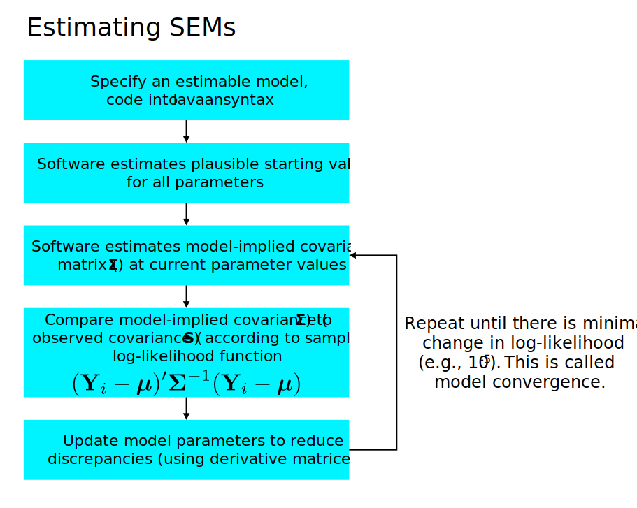
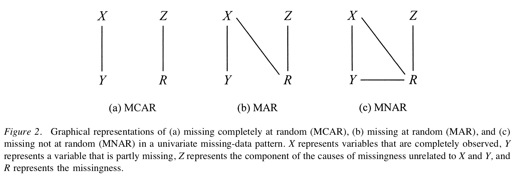

<style type="text/css">
body{ font-size: 24px; max-width: 1600px; margin: auto; padding: 1em; }
code.r{ font-size: 20px; }
p { padding-top: 8px; padding-bottom: 8px; }
pre { font-size: 16px; }
ol li:last-child { margin-bottom: 1.5em; }
ol li:first-child { margin-top: 1.5em; }
</style>

```{r setup, include=FALSE}
if (!require(pacman)) { install.packages("pacman"); library(pacman) }
p_load(knitr, MASS, tidyverse, viridis, lavaan, modelr, semPlot, psych, nonnest2, AICcmodavg, semTools, DiagrammeR, mlbench)
knitr::opts_chunk$set(echo = TRUE) #print code by default
options(digits=3)
set.seed(15092) #to make simulated data the same across computers

#small function to plot all SEM diagrams using
semPaths_default <- function(lavObject, sizeMan=15, ...) {
  require(semPlot)
  semPaths(lavObject, nCharNodes = 0, sizeMan=sizeMan, sizeMan2=4, sizeLat = 13, sizeLat2=7, ...)
}
```

If you have followed the class up to this point, you now have all of the core ingredients necessary to conduct basic SEM analyses! Now, as we move forward with using SEM to characterize a variety of datasets, there are a few odds and ends that are important to know.

# Ill conditioning

Let's return to our example from Week 1 of the class, which focused on housing prices in Boson. What if we believe that nitric oxide levels (`nox`) and crime predict home prices? We can add these as predictors to a path analysis, just as in standard multiple regression.

Furthermore, let's hypothesize that the proximity of a home to large highways (`rad`) predicts the concentration of nitric oxides, which predicts lower home prices.

The model syntax could be specified as:

```{r}
#example dataset from mlbench package with home prices in Boston by census tract
data(BostonHousing2)
BostonSmall <- BostonHousing2 %>% dplyr::select(
  cmedv, #median value of home in 1000s
  crim, #per capita crime by town
  nox, #nitric oxide concentration
  lstat, #proportion of lower status
  rad #proximity to radial highways
  ) %>% mutate(log_crim = log2(crim))

lavaan_m2 <- '
cmedv ~ log_crim + nox #crime and nox predict lower home prices
nox ~ rad #proximity to highways predicts nox
'
mlav2 <- sem(lavaan_m2, data=BostonSmall)
```

The model looks like this (using the handy `semPaths` function from `semPlot`):

```{r}
semPaths(mlav2, what='std', nCharNodes=6, sizeMan=10,
         edge.label.cex=1.25, curvePivot = TRUE, fade=FALSE)
```

Here's the text output:

```{r}
summary(mlav2)
```

A few things to note:

1. Note the warning: 'some observed variances are (at least) a factor 1000 times larger than others.' This is called ill conditioning.
2. Our hypotheses all seem to be supported.
3. The model chi-square is highly significant, suggesting poor global model fit.

Parameter estimation can be hampered when the variances of variables in the model differ substantially (orders of magnitude). The most common consequences are that the model does not converge or that you get warnings about problems estimating the standard errors. Here, the model did not fail in these ways, but did object to the variances. Given the above warning, let's take a look.

```{r}
varTable(mlav2)
```

Looks like the scale of `nox` is *much* smaller than any other predictor, likely because it's in parts per 10 million! We can rescale variables in this case by multiplying by a constant. This has no effect on the fit or interpretation of the model -- we just have to recall what the new units represent. Also, you can always divide out the constant from the parameter estimate to recover the original units, if important.

```{r}
BostonSmall <- BostonSmall %>% mutate(nox = nox*100) #not parts per 100,000 not 10 million
mlav2 <- sem(lavaan_m2, data=BostonSmall)
summary(mlav2)
```

Note that our fit statistics do not change at all (because the model converged in the first place), and our parameter estimates only change by a factor of 100, which is because we rescaled `nox` by multiplying the value x100.

# Estimators

Estimators are algorithms that seek to fit a given model (for us, variants of SEM) to a dataset. By 'fit a model,' I mean that we try to identify parameter estimates that minimize the discrepancy between the observed covariance matrix, $\boldsymbol{S}_{XX}$ and the model-implied covariance matrix, $\boldsymbol{\Sigma}(\hat{\boldsymbol{\theta}})$. The algorithm searches *iteratively* for parameter estimates that would reduce the discrepancy, and the algorithm *converges* when the discrepancy cannot be further reduced by alternative parameter estimates.

Remember this:



In addition to 'ML' -- our trusty default maximum likelihood estimator -- ther are many other estimators for SEMs. Here's the synopsis from the lavaan help (http://lavaan.ugent.be/tutorial/est.html):

If all data is continuous, the default estimator in the lavaan package is maximum likelihood (estimator = "ML"). Alternative estimators available in lavaan are:

- "GLS": generalized least squares. For complete data only.
- "WLS": weighted least squares (sometimes called ADF estimation). For complete data only.
- "DWLS": diagonally weighted least squares
- "ULS": unweighted least squares

Many estimators have 'robust' variants, meaning that they provide robust standard errors and a scaled test statistic. For example, for the maximum likelihood estimator, lavaan provides the following robust variants:

- "MLM": maximum likelihood estimation with robust standard errors and a Satorra-Bentler scaled test statistic. For complete data only.
- "MLMVS": maximum likelihood estimation with robust standard errors and a mean- and variance adjusted test statistic (aka the Satterthwaite approach). For complete data only.
- "MLMV": maximum likelihood estimation with robust standard errors and a mean- and variance adjusted test statistic (using a scale-shifted approach). For complete data only.
- "MLF": for maximum likelihood estimation with standard errors based on the first-order derivatives, and a conventional test statistic. For both complete and incomplete data.
- "MLR": maximum likelihood estimation with robust (Huber-White) standard errors and a scaled test statistic that is (asymptotically) equal to the Yuan-Bentler test statistic. For both complete and incomplete data.

For the DWLS and ULS estimators, lavaan also provides 'robust' variants: WLSM, WLSMVS, WLSMV, ULSM, ULSMVS, ULSMV. Note that for the robust WLS variants, we use the diagonal of the weight matrix for estimation, but we use the full weight matrix to correct the standard errors and to compute the test statistic.


# Missing data

By default, `lavaan` will usually apply listwise deletion such that people missing *any* variable are dropped. This is usually not a great idea, both because you can lose a ton of data and because it can give a biased view of the data (for details, see Schafer and Graham, 2002, *Psychological Methods*). Although the details are beyond this overview, it's usually best to use so-called full-information maximum likelhood (FIML) under an assumption that the data are missing at random (MAR) -- a technical term that missingness on a given variable can be related to other variables, but not to the variable itself. Using FIML, the estimation tries to estimate all parameters based on the cases that have available data. If you want to understand this better, read Craig Enders [great 2010 book](http://www.appliedmissingdata.com), *Applied Missing Data Analysis*.

In lavaan, add `missing='ml'` to the `cfa`, `sem`, or `lavaan` function calls in order to request that `lavaan` use all available data (not just complete data) in estimating model parameters. Importantly, assuming that the data are MAR, full information estimation should *improve* the accuracy of parameter estimates, likely making the estimates more similar to what we would obtain if we had no missing data at all. Said more formally, FIML will produce unbiased parameter estimates and standard errors if the data are MAR or MCAR (see below).

## Missing data mechanisms

<h4>From Schafer and Graham, 2002, Psychological Methods</h4>



## Estimators versus full information estimation

Please note that the estimator used to fit a SEM is different from FIML or the idea of full information. Specifically, the estimator is the algorithm by which we estimate model parameters based on the data. Up to this point, we have focused on maximum likelihood (ML) as the primary estimation approach. Although ML is indeed very useful as a default *estimator*, full information maximum likelihood (FIML) is not a *variant* of ML estimation, but instead a *property* of it. 

At a basic level, the FIML approach changes the individual likelihood function -- that is, the likelihood of observing an *individual's* data given a model with a set of parameter estimates. More specifically, FIML does not require that every case have the same number of observed variables when estimating the individual likelihood. Rather, the individual likelihood is based on *all available data*, and the individual only contributes to parameter estimates for which he/she has relevant data. For example, if I lack a score on an item underlying a latent factor, my data will not contribute to the corresponding factor loading estimate.

As a final technical note, the model chi-square and corresponding fit statistics are a bit different under a FIML approach. Specifically, FIML always estimates two models, the H0 model and the H1 model. The H0 model is the "unrestricted” or saturated model in which all variables are correlated. The H1 model is the model specified by you. The difference between the two log-likelihoods is used to derive the chi-square under FIML, rather than just using the fit function from ML alone.

Returning to 'full information,' any estimator that uses all available information to estimate every parameter in a model is a 'full information estimator.' For example, Bayesian estimators of SEMs (aka BSEM) also provide full information estimates of parameters.

## Illustration of FIML approach to SEM analysis

Let's take the Holzinger-Swineford example from the lavaan tutorial, where there were 9 items that measured putatitively different facets of intelligence: visual, textual, and speed. The observed variables are `x1-x9`.

From the 'lavaan' [tutorial](http://lavaan.ugent.be/tutorial/index.html):

This is a 'classic' dataset that is used in many papers
and books on Structural Equation Modeling (SEM), including some manuals
of commercial SEM software packages. The data consists of mental ability
test scores of seventh- and eighth-grade children from two different
schools (Pasteur and Grant-White). In our version of the dataset, only 9
out of the original 26 tests are included. A CFA model that is often
proposed for these 9 variables consists of three latent variables (or
factors), each with three indicators:

-   a *visual* factor measured by 3 variables: `x1`, `x2` and `x3`
-   a *textual* factor measured by 3 variables: `x4`, `x5` and `x6`
-   a *speed* factor measured by 3 variables: `x7`, `x8` and `x9`

```{r echo=FALSE, message=FALSE}

HS.model <- ' visual  =~ x1 + x2 + x3
              textual =~ x4 + x5 + x6
              speed   =~ x7 + x8 + x9 '
fit <- cfa(HS.model, data=HolzingerSwineford1939)
```

```{r cfa, echo=FALSE, dev=c('png','pdf'), dpi=c(140,140)}
semPaths(fit, layout="tree", curve=1, rotation=4, 
nCharNodes=0, mar=c(3,20,3,20), 
border.width=1.0, esize=1.0, edge.color="black", 
label.scale=FALSE,
label.cex=1.0,
residuals=FALSE,
fixedStyle=1,
freeStyle=1,
curvePivot=FALSE,
sizeMan=7, sizeLat=10)
```

I'm going to 'miss out' a few data points for illustration

```{r, echo=FALSE}
HolzingerSwineford1939_miss <- HolzingerSwineford1939
HolzingerSwineford1939_miss$x1[seq(1, 300, by=10)] <- NA
HolzingerSwineford1939_miss$x6[seq(2, 300, by=10)] <- NA
```


Here's what happens with the default:
```{r}
fit_listwise <- cfa(HS.model, HolzingerSwineford1939_miss, estimator="ML")
summary(fit_listwise, fit.measures=TRUE)
```

Note the output:
```
                                                 Used       Total
  Number of observations                           241         301
```

This should be very worrisome!!

Okay, here's the same model under FIML using `missing="ml"`.

```{r}
fit_fiml <- cfa(HS.model, HolzingerSwineford1939_miss, estimator="ML", missing="ml")
summary(fit_fiml, fit.measures=TRUE)
```

And this is more reassuring:

```
  Number of observations                           301
  Number of missing patterns                         3
```

Again, the theory and formal approach to missing data is beyond this tutorial, but I hope this gives a sense of how to handle missingness in `lavaan`. Note that WLS and WLSMV are complete case estimators, so doesn't allow for the FIML approach (it's not an ML estimator, after all). You can pass `missing='pairwise'` for the WLS family, which also estimates using parameters based on pairwise availability, though in a much less elegant way (I think).

# Categorical data

In 'vanilla' SEM using maximum likelihood estimation, we assume that the data are distributed as multivariate normal. This means, in part, that we assume that each variable is univariate normal. Like so:

```{r}
p1 <- ggplot(data = data.frame(x = c(-3, 3)), aes(x)) +
  stat_function(fun = dnorm, n = 500, args = list(mean = 0, sd = 1)) + ylab("Density") + xlab("Item distribution\n<---- Individual Differences ---->")
p1
```

Importantly, however, many data in social and behavioral sciences are dichotomous or polytomous in nature. These are distributed on an ordinal, or perhaps interval, scale. Furthermore, interval scaling is an *assumption* we often make that may not be supported in the data. For example, on a 1-5 Likert scale, what reassurance do we have that a one-point increase between 1 and 2 is the same as 4 and 5? Instead, we often have data that look more like this:

```{r, fig=TRUE}
df <- data.frame(x=c(rep(1, 50), rep(2, 25), rep(3, 15), rep(4, 10), rep(5, 3)))
ggplot(df, aes(x=x)) + geom_bar() + ylab("Frequency (n)") + xlab("Response")
```

In short, we often do not know whether the spacing between anchors is equal, a topic that get expanded on substantially in item response theory (IRT). Furthermore, ordinal data are often a poor approximation of a normal distribution, as in the figure above. This distribution is quite skewed and also 'chunky' in the sense that there are only interval-valued responses (e.g., no responses of 1.5 or 2.2). Altogether, treating such data as *normal* is often a tricky proposition.

**Rule of thumb:** If we have 5+ anchors for an item, we can probably treat it as continuous without major missteps. If we have < 5 anchors, the assumption of normality can yield biased parameter estimates and fit statistics. See Rhemtulla et al., 2012, *Psychological Methods* for further details. If we assume normality, we should also examine the distribution of items to see whether they are approximately normal. If not, this may be a further nudge in favor of modeling them as ordinal, not continuous.

## Modeling categorical data with a formal threshold structure

**What to do?** `lavaan` supports the formal treatment of endogenous categorical data using a threshold structure. This emerges from the view that the underlying distribution of an item is continuous (Gaussian), but our discretization (e.g., binary or polytomous) cuts this dimension at particular points. Here's an example from the Samejima graded threshold model with 4 anchors per item:

```{r}
df <- data.frame(x=c(-1.5, -0.5, 1.2), xend=c(-1.5, -0.5, 1.2), y=c(0, 0, 0), yend=c(0.45, 0.45, 0.45), label=c("tau[1]", "tau[2]", "tau[3]"))
df_labs <- data.frame(x=c(-2.0, -1, .35, 1.7), y=c(0, 0, 0, 0), label=c("Pr(y=1)", "Pr(y=2)", "Pr(y=3)", "Pr(y=4)"))
p1 <- ggplot(data = data.frame(x = c(-3, 3)), aes(x)) +
  stat_function(fun = dnorm, n = 500, args = list(mean = 0, sd = 1)) + ylab("Density") + xlab("Item distribution\n<---- Individual Differences ---->") +
  geom_segment(aes(x=x, xend=xend, y=y, yend=yend), data=df) +
  geom_text(aes(label=label, x=x, y=yend+0.02), data=df, parse=TRUE, size=8) +
  geom_text(aes(label=label, x=x, y=y), data=df_labs, parse=FALSE, size=6)
p1
```

We have 4 levels of the variable (1, 2, 3, 4), but only three thresholds -- each specifies the boundary between two adjacent levels (anchors). If we are motivated to account for this structure, these thresholds can be specified as free parameters in the model. This is essentially estimating where the $\tau$ parameters fall along the continuum; they need not be evenly spaced!

## Demo of categorical data in CFA

Typically, models with a threshold structure are estimated using a 'weighted least squares' (WLS) estimator, rather than maximum likelihood (ML; the typical estimator in SEM). Note that there are Bayesian and ML approaches to estimating a model with explicitly categorical data, but these are less common, especially in lavaan. The mean and covariance adjusted WLS (aka 'WLSMV') is usually the way to go because it can handle nonnormality of the multivariate distribution better than the typical WLS. See DiStefano and Morgan 2014, *Structural Equation Modeling*, for details.

Here's a quick demo -- what if we had only trichotomous items for each of our intelligence test items?

```{r, echo=FALSE}
HSbinary <- as.data.frame( lapply(HolzingerSwineford1939 %>% dplyr::select(starts_with("x")), cut, 3, labels=FALSE) )
```

```{r}
lattice::histogram(HSbinary$x1, xlab="Discrete x1")
```

We tell `lavaan` which items are ordered categorial using the `ordered` argument.

```{r}
HS.model <- ' visual  =~ x1 + x2 + x3
              textual =~ x4 + x5 + x6
              speed   =~ x7 + x8 + x9 
'
fit_cat <- cfa(HS.model, HSbinary, ordered=names(HSbinary))
summary(fit_cat)

```

Note that we now have threshold estimates for each item, where higher values denote a higher estimate for the boundary between one category and the next along the latent continuum that putatively underlies the item. Additional details about categorical data are beyond the scope here!

# Non-normality

Categorical/ordinal data are one source of violations of multivariate normality. But we may have continuously distributed data that are also not especially normal, as in the case of distributions with large skew or kurtosis. If the univariate distributions are not normal, then neither shall the multivariate distribution be normal.

If we have continuous data that violate normality, typically our chi-square will be too large -- thus, we will tend to reject models more often than we should. But, violations of normality will result in standard errors that are too small -- thus, we will tend to interpret too many parameters as significant (a kind of Type I error).

In SEM, there are separate workarounds for the model $\chi^2$ and standard error problems. But, these are often packaged together as 'robust' estimation approaches. Long story short, there is a corrected variant of the $\chi^2$ attributable to Satorra and Bentler, and later developed by Yuan and Bentler. This approach estimates a scaling correction factor that is based on estimates of multivariate kurtosis. The model chi-square is divided by the correction factor estimate a $chi^2$ to yield a global test that is robust to non-normality in the data. 

If the data are MVN, then the correction factor will be 1.0 -- and the robust and traditional $chi^2$ statistics will be very similar. But if the data is highly non-normal, the correction factor will go above 1.0 (e.g., 1.1 or 1.6). In general, it's probably a good idea to use the Satorra-Bentler $\chi^2$ to guard against the problem of rejecting too many well-fitting SEMs of non-normal data.

Correcting the standard errors for non-normality relies on what is called a Huber-White sandwich estimator. Completely skipping the details, the important point is that this estimator corrects for non-normality (as well as clustering/nesting of observations).

Putting these things together -- Satorra-Bentler $\chi^2$ and Huber-White SEs -- we arrive at what has been called the 'MLR' estimator in Mplus and lavaan. In general, this is probably a good 'go to' as your default estimator because of its attractive properties with non-normal data.

## Estimate the CFA with the MLR approaach

```{r}

HS.model <- ' visual  =~ x1 + x2 + x3
              textual =~ x4 + x5 + x6
              speed   =~ x7 + x8 + x9 '
fit <- cfa(HS.model, data=HolzingerSwineford1939, estimator="MLR")
summary(fit, fit.measures=TRUE)
```