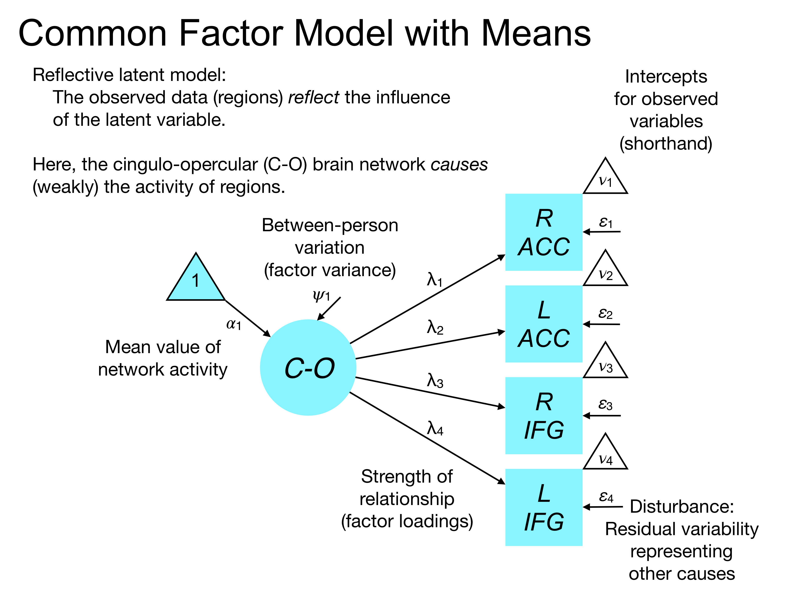
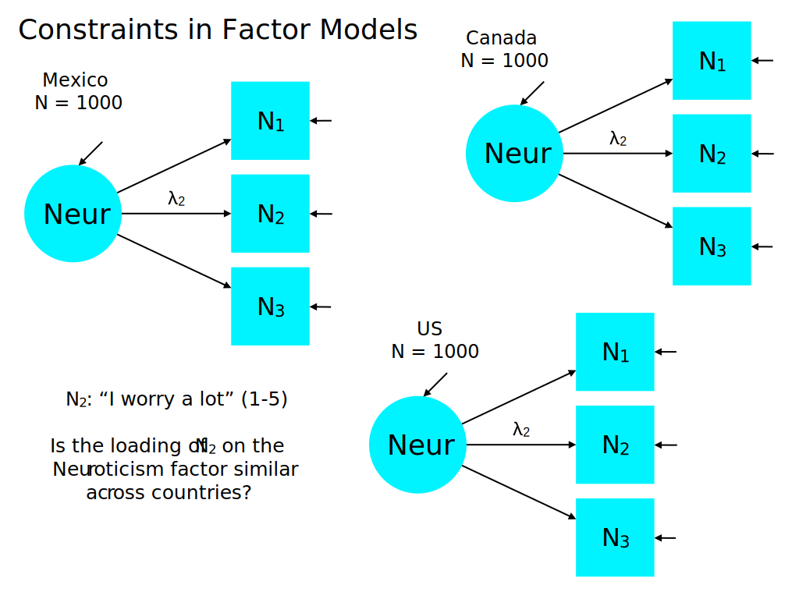
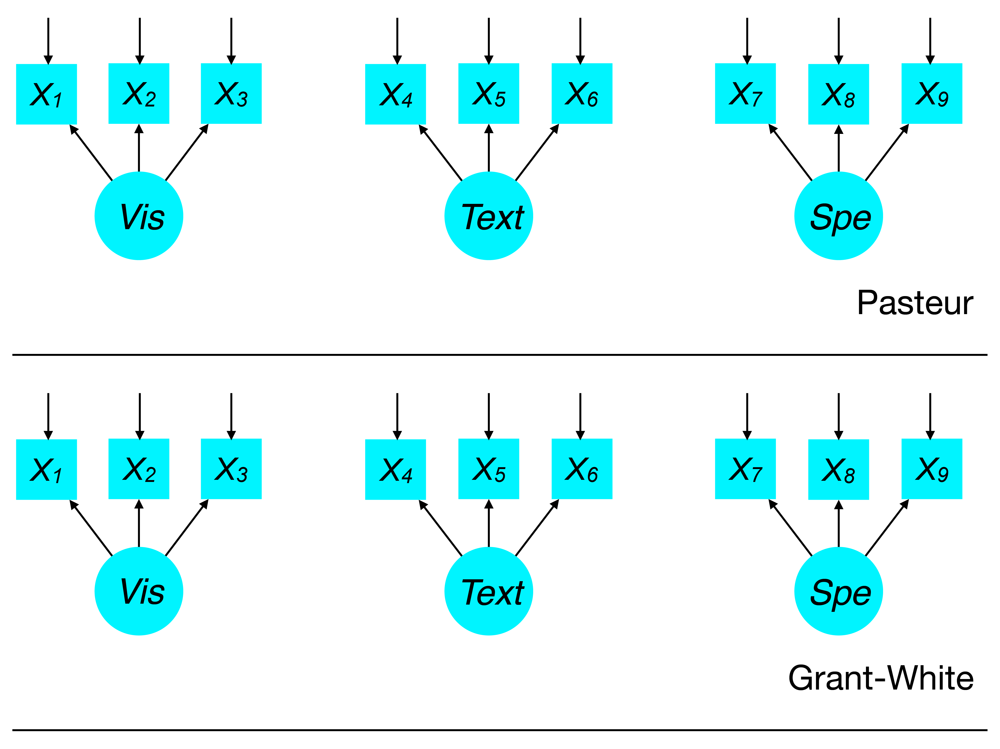

<style type="text/css">
body{ font-size: 24px; max-width: 1600px; margin: auto; padding: 1em; }
code.r{ font-size: 20px; }
p { padding-top: 8px; padding-bottom: 8px; }
pre { font-size: 16px; }
ol li:last-child { margin-bottom: 1.4em; }
ol li:first-child { margin-top: 1.4em; }
ol li { margin-top: 0.2em; margin-bottom: 0.2em; }
</style>

```{r setup, include=FALSE}
if (!require(pacman)) { install.packages("pacman"); library(pacman) }
p_load(knitr, MASS, tidyverse, viridis, lavaan, modelr, semPlot, psych, DiagrammeR, semTools, AICcmodavg, ggcorrplot, dplyr)
knitr::opts_chunk$set(echo = TRUE) #print code by default
options(digits=3)
set.seed(15092) #to make simulated data the same across computers

#small function to plot all SEM diagrams using
semPaths_default <- function(lavObject, sizeMan=11, ...) {
  require(semPlot)
  semPaths(lavObject, nCharNodes = 0, sizeMan=sizeMan, sizeMan2=4, sizeLat = 13, sizeLat2=7, ...)
}

```

# Mean structure

Up to this point in class, we have largely focused on understanding models of covariance structure. In many circumstances, however, we may be interested in understanding the means as well.

Let's consider a few examples:

1.  What is the mean difference in depression -- measured by a multi-item factor -- before and after cognitive behavior therapy?
2.  How does the mean level of conscientiousness (in a Big 5 sense) change over the life span in the population?
3.  Does a group who completes a mindfulness training show greater openness to experience than a group who completes a time management training?

In the depression example, notice how we are leveraging the power of SEM by specifying a measurement model for depression. This addresses measurement error formally (i.e., in the model) when testing for mean change over time. This should both increase the precision of our mean change estimate and reduce bias. This holds true for the conscientiousness question, too.

In the third example (mindfulness), we are interested in comparing means on a latent variable (openness) between groups who were randomized to different conditions. Although such questions are often addressed by ANOVA or t-tests, we can capture a similar phenomenon in SEM, with the added advantage of accessing measurement models.

## Notation for mean structure



Here, we use the triangle with a 1 inside to denote the regression of a variable (e.g., the factor scores) on a constant (1). 

When we regress any variable on a vector of 1s, we will obtain an expectation of its mean (assuming there are no other predictors).

When we regress a variable on a vector of 1s, along with predictors that vary between observations (e.g., personality test scores), then the regression on a constant yields the *intercept* -- the expectation of the variable when all predictors are zero.

Also note my shorthand notation in the diagram to denote intercepts for observed variables -- this avoids having to add many paths between the 1 triangle and each variable.

## Additional parameter vectors that are added for means

1.  $\boldsymbol{\nu}$: contains model-estimated intercepts (endogenous) and means (exogenous) for continuous *observed* variables.
2.  $\boldsymbol{\alpha}$: contains model-estimated intercepts (endogenous) and means (exogenous) for continuous *latent* variables.
3.  $\boldsymbol{\tau}$: contains model-estimated *thresholds* for categorical *observed* variables.

## Identification concerns with mean structure

*Kline Rule 15.4.* The parameters of a model with a mean structure include the

1.  means of the exogenous variables (except errors);
2.  intercepts of the endogenous variables; and
3.  number of parameters in the covariance structure, counted in the usual way for that type of model.

Up to this point, the number of elements in the covariance matrix (aka 'observations') has been: $p = k(k+1)/2)$ where $k$ is the number of variables.

With mean structure, the number of observations in the model is amended:

$$
\begin{equation}
p = \frac{k(k+3)}{2}
\end{equation}
$$

For example if we analyze a 5x5 covariance matrix along with corresponding means, then we have: 10 covariances ($k[k-1]/2$), 5 variances ($k$), and 5 means ($k$) for a total of 20 observations (unique pieces of information about the data structure).

# Equality constraints in SEM

An equality constraint specifies that the unstandardized estimates for two parameters in a model must be equal. In essence, instead of fitting two free parameters, the program fits only one. Why might this be useful? Constraints are primarily useful to test specific hypotheses.

## Is the association between violent video games and aggressive behavior equal between men and women?

This is a path analysis in which we analyze men and women separately (dividing into subsamples) and examine whether an association parameter is equal between sexes.

```{r, fig.height=2}
grViz("
digraph sexdiff {
  # a 'graph' statement
  graph [overlap = true, fontsize = 12]

  node [shape = box, fontname = Arial]
  vgames_M; aggress_M; vgames_F; aggress_F;

  { rank = same; vgames_M; aggress_M }
  { rank = same; vgames_F; aggress_F }

  # edges
  vgames_M:s -> aggress_M:s [dir='both', label='a'];
  vgames_F:s -> aggress_F:s [dir='both', label='b'];
}")
```

In other words, does $a$ equal $b$? From a parameter estimation standpoint, if $a$ and $b$ are free, we are estimating two parameters. If we enforce equality, then we are estimating only one: $a := b$. Therefore, in general, models with equality constraints are *nested* within models that lack such constraints. This holds true because a free model can capture the case when $a$ and $b$ are equal, even if both are free parameters.

## Is the relationship of "I worry a lot" with a neuroticism factor similar in the US, Canada, and Mexico?

This is a multiple-group analysis in which we have a covariance matrix for each country in three separate samples (each with $N = 1000$). The goal of the analysis is to check whether the factor loading for a specific item ("I worry a lot") is equivalent across countries. One could imagine also testing a broader family of models in which we equate all loadings across countries to examine *measurement invariance*, discussed below.



## Is the correlation between Anger and Sadness equal to the correlation betwen Happiness and Wellbeing?

In a four-factor model, we might be interested in whether the association of Anger and Sadness is equal in magnitude to the association of Happiness and Wellbeing? Remember that we constrain *unstandardized* estimates, so for interpretability, we might apply a unit variance identification (UVI) strategy so that the variances of each factor are on the same scale. Therefore, the covariances would also scale similarly.


## Take home message about constraints

There are many canonical examples of how constraints are used in the SEM literature. For example, in formal tests of measurement invariance, factor loadings are often equated to enforce similar associations between a factor and its indicators in different groups.

However, constraints are a more general tool for you as a researcher to test a hypothesis about the components of a SEM. Like modification indices, constraints should be well-founded conceptually, but are open to abuse or confusion. It is up to you as a scientist to decide whether testing a nested model in which some parameters are equated is a meaningful alternative account of the data. Simply observing that two parameters estimates are around 0.8 should not motivate you to test a model in which they are equated.

Comparing equality-constrained versus free (nested) models is a test of *approximate equivalence*. That is, the free model will, by definition, fit better because it has more free parameters. However, does if fit substantially (or statistically significantly) better? If the nested model comparison is not significantly different, it suggests that the model does not fit substantially *worse* with the addition of equality constraints. In general, the principle of parsimony should tilt our preference toward models that fit the data well using fewer parameters. Thus, if the constrained model is not inferior, it is often preferred.

## Statistical tests of constraints

The most common approach to examining the effect of constraints on fit is nested model comparison using a likelihood ratio test (LRT). This is also sometimes called a chi-square difference test; these tests are usually interchangeale. As a reminder, the model chi-square difference test is based on the difference of the model $\chi^2$ for the constrained versus free models and the difference in degrees of freedom (constrained - free). The difference in $\chi^2$ is itself $\chi^2$ distributed with degrees of freedom equal to the difference between models. 

If the LRT/$\chi^2$ difference is significant (often $p < .05$), it indicates that the more constrained model fits significantly worse than the free model. But as we've discussed elsewhere, this test can become overpowered in large samples, so examining parameter differences in the free and constrained model is essential to get a sense of the practical differences. For example, if two factor loadings are 0.9 and 0.8 in the free case, but 0.86 in the constrained case, what would we do if the LRT had $p = .02$? How bad are residuals?

Note that the effect of constraints (or dropping paths, for that matter) can also be quantified using a *Wald W* statistic. This estimates the expected *increase* in the model $\chi^2$ if the parameter constraints were to be introduced to a free model. This is asymptotically equivalent (i.e., as sample size increases) to the model chi-square difference test and the LRT under most scenarios. The practical advantage of a Wald test is that one can test the effect of constraints on a model without needing to refit the model or specify new syntax. This is particularly handy for models that are slow to estimate and thus, that you don't want to refit.

Unlike the Wald W statistic, which is usually used to examine how model fit *worsens* with the addition of constraints, a modification index for a given path estimates the *improvement* in model $\chi^2$ if the path were included. Thus, if we constrain a number of paths to be equal, then examine the modification indices, we may learn which paths are unlikely to be equal -- as indicated by a large modification index. 

Modification indices are based on the Lagrange multiplier test (LMT), which (in this context) is a test of whether a candidate omitted parameter is equal to zero. Remember that if we don't specify a parameter in the model (e.g., a cross-loading), it is assumed to be zero. Although the LMT is usually computed on individual parameters (e.g., the table of modification indices), one can compute an LMT on a set of tests such as the hypothesis that all five potential cross-loadings are zero. See `lavTestScore` for details.

If you're curious about the relationships among these parameter equivalence testing approaches, see this: https://stats.idre.ucla.edu/other/mult-pkg/faq/general/faqhow-are-the-likelihood-ratio-wald-and-lagrange-multiplier-score-tests-different-andor-similar/.

## How to test constraints in lavaan

Let's return to our example from last week with Fear of Global Warming and Concern for Animal Welfare as examples that predict individual charitable contributions to environmental groups. For the moment, I've left out the donations part to focus only on the measurement model. What if we wanted to test the hypothesis that all of the indicators of FoGWar are equally associated with the construct? (As we'll see below, this is called tau-equivalence).

Raw correlation matrix:

```{r}
#We will rig things a bit to have the factor loadings of the 4 indicators vary: .6, .7, .8, and .7.

#this is just the syntax to simulate the data
demo.model <- '

l_FoGWar =~ .6*FoGWar1 + .7*FoGWar2 + .8*FoGWar3 + .7*FoGWar4  #definition of factor FoGWar with loadings on 4 items
l_CoAWe =~ .75*CoAWe5 + .85*CoAWe6 + .8*CoAWe7 + .8*CoAWe8  #definition of factor CoAWe with loadings on 4 items

l_FoGWar ~~ 0.4*l_CoAWe

#error variance in inverse proportion to factor loadings
FoGWar1 ~~ (1-.6^2)*FoGWar1
FoGWar2 ~~ (1-.7^2)*FoGWar2
FoGWar3 ~~ (1-.8^2)*FoGWar3
FoGWar4 ~~ (1-.7^2)*FoGWar4
CoAWe5 ~~ (1-.75^2)*CoAWe5
CoAWe6 ~~ (1-.85^2)*CoAWe6
CoAWe7 ~~ (1-.8^2)*CoAWe7
CoAWe8 ~~ (1-.8^2)*CoAWe8
'

# generate data; note, standardized lv is default
simData <- lavaan::simulateData(demo.model, sample.nobs=500)

# round(cor(simData), 2)
ggcorrplot(cor(simData))
```

```{r}
#note: we specify FoGWar1 twice as an indicator 
#the first NA* tells lavaan to free the loading
#the second f1* provides a parameter label for the loading so we can constrain it later

msem.syntax <- '
#definition of factor FoGWar with loadings on 4 items
l_FoGWar =~ NA*FoGWar1 + f1*FoGWar1 + f2*FoGWar2 + f3*FoGWar3 + f4*FoGWar4

#definition of factor CoAWe with loadings on 4 items
l_CoAWe =~ NA*CoAWe5 + CoAWe6 + CoAWe7 + CoAWe8

#unit variance identification (since we want to compare all factor loadings)
l_FoGWar ~~ 1*l_FoGWar
l_CoAWe ~~ 1*l_CoAWe

l_FoGWar ~~ l_CoAWe
'

msem <- sem(msem.syntax, simData) #standardize factor variances to avoid first loading at 1.0.
#summary(msem, fit.measures=TRUE)
fitMeasures(msem)[c("chisq", "df", "pvalue", "rmsea", "srmr", "cfi")]
semPaths_default(msem)
inspect(msem)
```

### Wald test

This is implemented by the `lavTestWald` function in `lavaan`:


```{r}
con <- '
f1==f2
f1==f3
f1==f4
'

lavTestWald(msem, constraints = con)
```

Note that the constraints must be *unique* to have the Wald test be estimable. Thus, after we specify `f1==f2` and `f1==f3`, this implies that `f2==f3` (transitivity) and we should not include that in the syntax.

Here, we find a significant *p*-value, suggesting that the fit is significantly worse if we force the loadings of FoGWar indicators to be equal.

### Likelihood ratio test / model chi-square difference test

The `anova` function in `lavaan` will compute the LRT for nested models. It requires the researcher to fit two nested models, then compare them. Here, we can fit the constrained model where the loadings for all items on FoGWar are equal.

```{r}
msem_eq.syntax <- '
l_FoGWar =~ NA*FoGWar1 + f1*FoGWar1 + f1*FoGWar2 + f1*FoGWar3 + f1*FoGWar4  #equate loadings by using the same parameter label
l_CoAWe =~ NA*CoAWe5 + CoAWe6 + CoAWe7 + CoAWe8

l_FoGWar ~~ 1*l_FoGWar
l_CoAWe ~~ 1*l_CoAWe
l_FoGWar ~~ l_CoAWe
'

#same model, but using unit loading identification (ULI) approach
# msem_eq.syntax <- '
# #equate loadings by using the same parameter label
# l_FoGWar =~ f1*FoGWar1 + f1*FoGWar2 + f1*FoGWar3 + f1*FoGWar4  
# 
# l_CoAWe =~ NA*CoAWe5 + CoAWe6 + CoAWe7 + CoAWe8
# 
# l_FoGWar ~~ l_FoGWar #free factor variance
# l_CoAWe ~~ 1*l_CoAWe
# l_FoGWar ~~ l_CoAWe
# '

msem_eq <- sem(msem_eq.syntax, simData) #standardize factor variances to avoid first loading at 1.0.
#summary(msem_eq, fit.measures=TRUE)
fitMeasures(msem_eq)[c("chisq", "df", "pvalue", "rmsea", "srmr", "cfi")]
semPaths_default(msem_eq)
inspect(msem_eq)
```

By using the same parameter label `f1`, `lavaan` constrains those parameters to be equal. This is a convenient way to specify equality constraints.

```{r}
anova(msem, msem_eq)
```

We see the same effect for the LRT as the Wald test (no surprise there), suggesting worse fit under constrained loadings. 

Altogether, note that we achieved two hypothesis tests using different means. In the `lavTestScore` approach, we compute the *decrease* in fit (as indicated by higher $\chi^2$) when we constrain FoGWar factor loadings to be equal based on a model in which the loadings are freely estimated. In the conventional LRT or $\chi^2$ difference test, we fit both the free and constrained models and test the difference in fit based on difference in likelihoods.

# Constraints in measurement models: congeneric, tau equivalent, and parallel specifications

In measurement models, there is a useful set of constraints one can apply to understand the similarity of associations between indicators and latent variables. In a typical CFA, we estimate factor loadings for each indicator (excepting the reference if we use the unit loading identification strategy). As we've discussed, the standardized loadings provide an interpretable measure of how associated each indicator (item) is with the factor. Items with lower factor loadings reflect the latent construct to a lesser degree.

What if, however, we wish to test the hypothesis that all items measure the construct equally well? Likewise, what if we also wish to know if all items have equal precision in their measurement (i.e., proportion of item variance explained by the factor)? These are hypotheses that can be tested using constraints.

## Congeneric

The first type of factor model is called *congeneric*. This is what we've come to expect of vanilla CFA: we specify that certain items load onto certain factors. Factor loadings and error variances (disturbances) are freely estimated for each indicator (excepting the reference indicator under ULI). A congeneric model has the following properties:

1.  Factor loadings are freely estimated for each indicator
2.  Disturbances (aka measurement error, error variance) are freely estimated for each indicator
3.  Disturbances are independent (conditional independence assumption)
4.  Indicators load onto only one latent variable (no cross-loadings)

Under these assumptions, the observed correlations among indicators reflect the influence of the latent variables, but we do not assume that a) the proportion of true score (factor score) variance is equal across indicators, or that b) that the latent construct scales with item responses equally.

The congeneric model is not guaranteed. For example, if we have 'complex indicators' that have cross loadings, or if there are correlated errors among indicators, this does not satisfy congenericity.

## Tau equivalent

Congeneric models already have certain constraints on structure, namely that certain items load onto certain factors according to our hypotheses. Unlike EFA, where all items technically load onto all factors, we typically fix many elements in $\lambda$ to zero to enforce a hypothesis about latent structure. If the congeneric model fails, we would not usually move on to test more restrictive measurement models. But if the congeneric model fits well, we might consider additional measurement tests.

First, we will consider what's called tau-equivalence, defined as:

1.  Loadings on a given factor are equal
2.  Error variances are free

Note we inherit the other features of the congeneric model, namely independent errors and no cross-loadings.

If loadings are equal, then each indicator has an equivalent association to the underlying construct. Therefore, a one-unit change in the underlying factor is associated with the same increase in the response to each indicator.

Note that measures of internal consistency are implicitly based on a tau-equivalent model. This is part of why coefficient alpha is technically a lower bound on the test's reliability. If we do not have a tau-equivalent factor model, coefficient alpha will underestimate the reliability of the scale. For details, see Graham 2006 *Educational and Psychological Measurement*.

## Parallel

If we meet the assumptions of a tau-equivalent model, we might consider a further restriction called *parallel* structure.

1.  Loadings on a given factor are equal
2.  Error variances for indicators of a factor are equal

The additional requirement of equal error variances (disturbances) tests a model where each indicator has the same level of precision. This structure has two major implications. First, the amount of item variation attributable to the true score (in a CTT sense) is equal for all items. Second, the expected value of each of the items is the same -- i.e., the items are fungible. A parallel indicators model relates in part to the practice of developing parallel forms of a test where we wish to use a subsets of items from a broader pool to assess the same construct. To be confident that we are indeed measuring the same construct, we need to satisfy the parallel constraint step. That is, the model with parallel indicators should not fit worse than a tau-equivalent model, which should not fit worse than the congeneric model.

## Testing these constraints in practice

Going back to our FoGWar and CoAWe example, we can examine whether we can satisfy congeneric, tau-equivalent, and/or parallel structure. These structural tests should be applied sequentially. For example, if we do not have tau equivalence, we cannot have parallel structure. But, we can evaluate these structural tests for each factor individually -- one may be parallel, the other may be only congeneric.

### Congeneric

Though we didn't use the nomenclature, our initial two-factor CFA model with freed loadings is the congeneric case. As a reminder:

```{r}
summary(msem, standardized=TRUE)
```

Here, we have labeled the factor loadings for FoGWar, but we have not constrained them to be equal.

Note that the loadings for FoGWar are similar, but perhaps not equivalent. They range from .64 to .82. The question of tau equivalence is whether the loadings can be constrained to equality without reducing fit substantially. As we saw above, by using the same parameter loading for a set of indicators, `lavaan` will enforce an equality constraint.

### Tau equivalent

Above, we tested a model in which we equated FoGWar loadings. This is the tau equivalent model (for FoGWar, anyhow). As a reminder, the syntax looks like this:

```
msem_eq.syntax <- '
  #equate loadings by using the same parameter label
  l_FoGWar =~ NA*FoGWar1 + f1*FoGWar1 + f1*FoGWar2 + f1*FoGWar3 + f1*FoGWar4  
  l_CoAWe =~ NA*CoAWe5 + CoAWe6 + CoAWe7 + CoAWe8
  
  l_FoGWar ~~ 1*l_FoGWar
  l_CoAWe ~~ 1*l_CoAWe
  l_FoGWar ~~ l_CoAWe
'
```

As noted above, the premultiplication of `FoGWar1` by `NA` instructs `lavaan` to free the loading for the first indicator (as opposed to fixing it to 1.0). And the second premultiplication by `f1` instructs lavaan to fix all parameters (here FoGWar loadings) with the same `f1` label to be equal. This is the unit variance identification (UVI) approach. Look in the R code above for the unit loading identification (ULI) approach, which is commented out.

Here is the fit of the tau equivalent model:

```{r}
summary(msem_eq, standardized=TRUE)
```

And the LRT:

```{r}
anova(msem, msem_eq)
```

This recapitulates what we already reviewed above, but without calling the models congeneric and tau equivalent. As a reminder, the LRT suggested that model fit worsened when FoGWar loadings were equated.

**What about testing tau equivalence for CoAWe?**

The tests above suggest that tau equivalence does not hold for FoGWar, but perhaps it does for CoAWe.

```{r}
msem_tau_coawe.syntax <- '
l_FoGWar =~ NA*FoGWar1 + FoGWar2 + FoGWar3 + FoGWar4  #equate loadings by using the same parameter label
l_CoAWe =~ NA*CoAWe5 + f1*CoAWe5 + f1*CoAWe6 + f1*CoAWe7 + f1*CoAWe8

l_FoGWar ~~ 1*l_FoGWar
l_CoAWe ~~ 1*l_CoAWe
l_FoGWar ~~ l_CoAWe
'

#ULI approach -- same model
# msem_tau_coawe.syntax <- '
# l_FoGWar =~ FoGWar1 + FoGWar2 + FoGWar3 + FoGWar4  #equate loadings by using the same parameter label
# l_CoAWe =~ f1*CoAWe5 + f1*CoAWe6 + f1*CoAWe7 + f1*CoAWe8
# 
# l_FoGWar ~~ l_CoAWe
# '

msem_tau_coawe <- cfa(msem_tau_coawe.syntax, simData)
summary(msem_tau_coawe, fit.measures=TRUE, standardized=TRUE)
```

Let's compare to the congeneric model using an LRT. The tau equivalent model is nested in the congeneric.

```{r}
anova(msem, msem_tau_coawe)
```

The LRT suggests that the tau equivalent model is barely worse ($p = .04$) than the congeneric.

```{r}
aictab(list(congeneric=msem, tau=msem_tau_coawe))
fitMeasures(msem_tau_coawe)[c("chisq", "df", "pvalue", "rmsea", "srmr", "cfi")]
```

With the relative evidence approach, we see something perhaps less definitive: the LRT is barely significant (in our sample of 500), suggesting a failure of tau equivalence, but the AICc indicates that the tau equivalent model is nearly as good (difference of 1.7 points), and it is more parsimonious. We also find that the global fit measures are all acceptable.

This highlights the problem with relying on null hypothesis significance testing (NHST) alone to judge constrained models. One should make an informed judgment based on a) LRT, b) changes in global fit measures (esp. change in CFI), c) change in residuals under the constrained solution, and d) interpretability.

With regard to change in residuals, we can examine this in a few ways. I suggest looking at the absolute change in the residuals in correlational units. This captures the absolute difference between the congeneric and tau equivalent models (for CoAWe) in terms of fitting each cell of the covariance matrix. Note that the FoGWar residual differences should be zero because the models being compared are the same for this factor -- they only differ in CoAWe.

```{r}
abs(resid(msem, type="cor")$cov - resid(msem_tau_coawe, type="cor")$cov)
```

The reduction in fit for bivariate correlations falls in the .03 range for most indicators.

In this case, I would at least consider the parallel model.

### Parallel

In the parallel model, we add constraints on disturbances for the indicators (error variances). Let's apply these constraints to the tau-equivalent CoAWe model, leaving FoGWar as congeneric. Remember that we only consider the parallel model if the tau-equivalent step fits well.

```{r}
msem_parallel_coawe.syntax <- '
l_FoGWar =~ NA*FoGWar1 + FoGWar2 + FoGWar3 + FoGWar4  #equate loadings by using the same parameter label
l_CoAWe =~ NA*CoAWe5 + f1*CoAWe5 + f1*CoAWe6 + f1*CoAWe7 + f1*CoAWe8

l_FoGWar ~~ 1*l_FoGWar
l_CoAWe ~~ 1*l_CoAWe
l_FoGWar ~~ l_CoAWe

#equate residual variances
CoAWe5 ~~ rv1*CoAWe5
CoAWe6 ~~ rv1*CoAWe6
CoAWe7 ~~ rv1*CoAWe7
CoAWe8 ~~ rv1*CoAWe8
'

msem_parallel_coawe <- sem(msem_parallel_coawe.syntax, simData)
summary(msem_parallel_coawe, fit.measures=TRUE, standardized=TRUE)

```

The `f1` parameter label equates CoAWe factor loadings, whereas the `rv1` parameter label equates error variances. These parameter labels are arbitrary and chosen by you. I try to use a shorthand that is easy (for me) to remember.

Let's compare the congeneric, tau-equivalent, and parallel models using LRT:

```{r}
anova(msem, msem_tau_coawe, msem_parallel_coawe)
```

The parallel model does not fit significantly worse than the tau-equivalent model despite having three fewer parameters.

And now AICc and global fit:

```{r}
aictab(list(congeneric=msem, tau=msem_tau_coawe, parallel=msem_parallel_coawe))
fitMeasures(msem_parallel_coawe)[c("chisq", "df", "pvalue", "rmsea", "srmr", "cfi")]
```

AIC also suggests that the models all fit the data similarly. The parallel model is actually quite close to the congeneric case in the fit:parsimony tradeoff that AICc represents (remember its 'efficiency' property).

Altogether, this is a judgment call (as often happens in practice). I would err on the side of parsimony, potentially preferring the parallel model where the loadings and residual variances are equated. But I would want to make sure that I'm not missing any key covariance patterns that the congeneric model captures.

# Multiple groups

So far, we have primarily considered constraints in the context of a single sample, enforcing equality on different parameters in the model. Oftentimes, however, we are faced with questions in which we a) have multiple distinct groups or samples, or b) hypothesize that a categorical moderator may affect some of the parameters in our model. In either case, this is typically a multiple-groups problem in which we are interested in understanding how well a given SEM fits independent samples of data.

In the simplest case, we could simply run the SEM in each sample and compare the results qualitatively. An equivalent approach is to fit both groups simultaneously in a multiple-groups model, but allow *every* parameter to be free between groups.

Let's consider the example from the `lavaan` tutorial: http://lavaan.ugent.be/tutorial/groups.html. Here, we have data from intelligence tests conducted in two separate schools, Pasteur and Grant-White:

```{r}
data(HolzingerSwineford1939)
lapply(describeBy(HolzingerSwineford1939, HolzingerSwineford1939$school), function(df) {
  select(df, -trimmed, -vars, -se, -mad)
})
  
```

The variables `x1-x3` are indicators of visual processing, `x4-x6` reflect textual processing, and `x7-x9` measure processing speed.

## Fitting groups (schools) separately

Let's start by fitting SEMs to each school separately. We would not normally do this in practice given the advantages of testing multiple groups in one SEM. But it is useful to see how this works.

Here is the fit of a three-factor model to each group.

### Pasteur

We subset the data to Pasteur alone, then fit the CFA.

```{r}
HS.model <- '  visual =~ x1 + x2 + x3
              textual =~ x4 + x5 + x6
              speed   =~ x7 + x8 + x9 '

fit_pasteur <- cfa(HS.model, data = filter(HolzingerSwineford1939, school=="Pasteur"))
summary(fit_pasteur)
semPaths_default(fit_pasteur)
```

### Grant-White

Now the same for Grant-White, fitting the CFA after subsetting the data.

```{r}
### Grant-White
fit_grantwhite <- cfa(HS.model, data = filter(HolzingerSwineford1939, school=="Grant-White"))
summary(fit_grantwhite)
```

## Fitting groups together

We can fit the groups in a single model in which both contribute to the sample likelihood. Recall that the sample likelihood reflect the probability of the observed data given the model and parameters. If we consider all free parameters for one group as a vector, $\boldsymbol{\theta}_1$ and free parameters for the other group as a vector, $\boldsymbol{\theta}_2$, then the total number of free parameters, $q$ is simply $\boldsymbol{\theta}_1 + \boldsymbol{\theta}_2$. In this way, each sample contributes independently to the sample likelihood function insofar as the parameters are completely separated by group.

We can fit multiple groups in SEM using the `group` argument in `lavaan`. Let's add a grouping structure to the intelligence testing example:

```{r}
fit_combined <- cfa(HS.model, data = HolzingerSwineford1939, group="school", meanstructure=FALSE) #lavaan will include means/intercepts by default in multiple-group analysis
summary(fit_combined, fit.measures=TRUE, standardized=TRUE)
```

We are now provided with parameter estimates for each group. We also have the $\chi^2$ contribution of each group to the total model $\chi^2$. Notice that the $\chi^2$ for each group is identical to the $\chi^2$ obtained when we fit the samples independently. Thus, the jumping off point for most multiple-group analyses is a free model in which all parameters are estimated uniquely in each group.

Also note that the model degrees of freedom is 48, whereas the individual school fits were 24 df each. Thus, in the multiple-groups model with no constraints, the $\chi^2$ is the sum of the individual group model $\chi^2$ values. Likewise, the degrees of freedom in the multiple-groups case is the sum of the individual group model dfs.

This model specification essentially looks like this:

{width=800px}

Note that the model is partitioned by group. No person was observed in both schools, and thus, we would never consider whether the `Vis` factor in Pasteur correlates with the `Vis` factor in Grant-White. Rather, in multiple-groups SEM, we are interested in testing how multiple covariance matrices (one per group) are explained by a SEM that has as many parameters in common as fits well.

The free model is not very parsimonious, nor does it usually address our substantive research questions. In fact, we are often interested in testing the hypothesis that the latent structure (or at least part of it) is equivalent across groups. If we translate a measure of personality from English to Dutch, it would be ideal if the latent structure was the same in both populations. This would let us compare results across nations without concern that the tests are measuring different constructs in each nation. Likewise, if we wish to compare rates of change in aggressive behaviors between prison and psychiatric settings, we wish to test a hypothesis about relative equality in change parameters across settings.

```{r}
inspect(fit_combined)
#semPaths_default(fit_combined)
```

Thus, we can apply the same general idea of applying equality constraints *between* groups as we did in the single sample case above. For multiple group analyses, lavaan uses a vector of parameter loadings to indicate what equality constraints to apply in each group. In the two-school example, what if we wish to equate factor loadings on the `visual` factor across groups? We can add a two-element parameter label vector in front of each loading (e.g., `c(f1, f1)*x1`). 

```{r}
HS.model_floadings_vis <- '  visual =~ c(f1,f1)*x1 + c(f2,f2)*x2 + c(f3,f3)*x3
              textual =~ x4 + x5 + x6
              speed   =~ x7 + x8 + x9 '

floadings_vis <- cfa(HS.model_floadings_vis, data = HolzingerSwineford1939, group="school")
summary(floadings_vis)
```

# Measurement invariance

For a good summary of how to present measurement invariance tests, see: http://www.lesahoffman.com/CLP948/CLP948_Example07a_CFA_MG_Invariance.pdf

The code is in Mplus, but the description is general.

The `measEq.syntax` function from the `semTools` package provides a convenient way to obtain syntax that tests different steps of measurement invariance, ranging from configural through strict invariance. It applies the appropriate constraints for measurement invariance tests:

-  Configural: factor patterns are the same among groups (i.e., estimate free parameters in $\lambda$). Factor means at 0.
-  Weak (aka metric): factor loadings equated among groups. Factor means at 0.
-  Strong (aka scalar): factor loadings and item intercepts equated among groups. Factor mean at 0 in one group (reference), freely estimated in others.
-  Strict: factor loadings, item intercepts, and residual variances equated among groups. Factor mean at 0 in one group (reference), freely estimated in others.

Integrating (blurring?) over a huge swath of literature, I would recommend satisfying at least *strong* invariance if you want to compare groups on factor means, variance, or covariances. There is less general support for requiring strict invariance, since that essentially forces the uniqueness of each item (i.e., variance not attributable to the factor) to be the same across groups. This also implies equal reliability across groups, assuming equal factor variances. There is not a huge conceptual gain in demonstrating strict MI for most applications, in my opinion.

Increasingly, change in CFI, not LRT significance, is seen as a sensitive test of measurement noninvariance (i.e., that the measure functions differntly in some way by group). Cheung and Rensvold, 2002, *Structural Equation Modeling* suggest that an increase in CFI of .01 between a more constrained model (e.g., strong invariance) and a less constrained model (e.g., weak invariance) may indicate measurement *noninvariance*. Meade, Johnson, and Braddy (2008) found that CFI changes as little as .002 may be indicative of a problem with invariance.

Here, we will initially stick to LRT. We will use the `compareFit` function from `semTools`. This provides a broader set of summary statistics when comparing the global fit of multiple models. To use it, we must pass in a named list of fitted lavaan models. Also note the use of the `nested` argument. If `TRUE`, `compareFit` will conduct LRTs on our behalf to test chi-square differences.

```{r}
to_constrain <- c("configural", "loadings", "intercepts", "residuals", "means")
mlist <- list()
for (i in 1:length(to_constrain)) {
  geq <- if(i==1) { "" } else { to_constrain[2:i] }
  mlist[[ to_constrain[i] ]] <- measEq.syntax(configural.model=HS.model, data = HolzingerSwineford1939, ID.fac="UV", 
                         group = "school", return.fit=TRUE, group.equal=geq)
}
fit_summary <- compareFit(mlist, nested=TRUE)
fit_summary

#deprecated, handy, function that generates equivalent results
#mlist <- measurementInvariance(model=HS.model, data = HolzingerSwineford1939, strict=TRUE, std.lv=TRUE, group = "school")
```

## Weak invariance

Although the `measEq.syntax` function is great, it is often useful to have more control over what is equated among groups while avoiding the verbose syntax of needing to label every parameter constraint. Lavaan provides the `group.equal` argument, which can accept any of the following: `"loadings"`, `"intercepts"`, `"means"`, `"thresholds"`, `"regressions"`, `"residuals"`, `"residual.covariances"`, `"lv.variances"`, or `"lv.covariances"`. See `?lavOptions` for details.

For the weak invariance model, we would use `group.equal="loadings"`. Note that we have to be careful about the `std.lv` argument when fitting multiple groups. There are two ways to identify the weak invariance model:

1.  Unit loading identification (ULI)
    +  1a.  The same reference indicator fixed at 1 for each factor in each group.
    +  1b.  Factor loading for remaining indicators equated across groups.
    +  1c.  Factor variances free in all groups.
2.  Unit variance identification (UVI)
    +  2a.  No reference indicator.
    +  2b.  All loadings equated equated across groups.
    +  2c.  Factor variances set to 1.0 in one group and free in the others.

Note that passing `std.lv=TRUE` to `sem` will setup the UVI properly in a single-group analysis. But under multiple groups, at present it will set factor variances to 1 in all groups, which does not satisfy 2c above. Thus, I would suggest not using `std.lv=TRUE` and not taking the UVI approach. Instead, the ULI (reference indicators) is easy to setup. I include syntax below for UVI but you'll see it is a bit tricky.

Small sidebar: the `measEq.syntax` function above *does* handle the UVI/ULI challenge in invariance testing internally, so you can use `TRUE` or `FALSE` above and get equivalent results (as you should).

```{r}
mconfigural <- sem(HS.model, data = HolzingerSwineford1939, std.lv=FALSE, group = "school")

#ULI approach (reference indicator)
mweak <- sem(HS.model, data = HolzingerSwineford1939, std.lv=FALSE, group = "school", group.equal="loadings")

#Manual UVI approach since std.lv=TRUE gives improper (nonequivalent) results
mmod_uvi <-'
  visual  =~ NA*x1 + x2 + x3
  textual =~ NA*x4 + x5 + x6
  speed   =~ NA*x7 + x8 + x9 

#at present, lavaan does not allow parameter labels to be combined with constraints, such as c(1, v1)
visual ~~ c(v1, v2)*visual
textual ~~ c(t1, t2)*textual
speed ~~ c(s1, s2)*speed

#thus, use constraints to enforce the structure of fixing variances to 1.0 in one group, free in others
v1==1
t1==1
s1==1
'

mweak_uvi <- sem(mmod_uvi, data = HolzingerSwineford1939, std.lv=FALSE, group = "school", group.equal="loadings", meanstructure=TRUE)
```

Let's check the parameter matrices for the UVI weak invariance model:

```{r}
inspect(mweak_uvi)
```

And we can inspect the fit:

```{r}
summary(mweak_uvi, fit.measures=TRUE)
```

### Are the weak ULI and weak UVI models equivalent?

Let's return to the handy `net` function from `semTools`:

```{r}
semTools::net(mweak, mweak_uvi)
```

## Strong invariance

1.  Equate loadings and intercepts across groups
2.  Free item residual variances across groups
3.  Fix factor means at zero in one group, free in others (reference group approach)

The UVI/ULI identification steps are the same as in the weak invariance model.

```{r}
mstrong <- sem(HS.model, data = HolzingerSwineford1939, std.lv=FALSE, group = "school", group.equal=c("loadings", "intercepts"), meanstructure=TRUE)

summary(mstrong) #useful to double check which parameters are equated.
anova(mweak, mstrong)
```

Consistent with the above output of `measEq.syntax`, the LRT indicates that constraining the intercepts to equality *worsens* fit. Likewise, the AIC is 28 points worse, a large reduction in relative fit. What might be the problem? By constraining the loadings and intercepts to equality, we are implying that at a given level of the factor, the expected value of each indicator shoud be equal between groups. This is true because we have equated the strength of association between the factor and the indicators via the loadings. 

## Partial invariance

But if the strong invariance model is worse than the weak MI model, it implies that the expected value of at least one indicator at a given level of the factor differs between groups. In other words, the average level of an indicator is higher or lower in one group even after accounting for the part explained by the factor.

When mean structure is considered in the common factor model, the predicted values for a given indicator, $\textbf{y}_i$, are:

$$
\textbf{y}_i = \boldsymbol{\nu}_i + \boldsymbol{\Lambda}_y \boldsymbol{\eta}_i + \boldsymbol{\varepsilon}_i
$$

Note that we don't have an any covariates predicting factor scores or indicators. These would be require an extension of the model. And more matrices!

But the main idea here is that we now have an intercept $\boldsymbol{\nu}_i$ for the item $\textbf{y}_i$. We often add mean structure to a SEM for two reasons:

-  we wish to compare groups on factor means (e.g., does group A have higher neuroticism scores than group B)
-  items have a nonlinear relationship to the factor (more common in variants of IRT)

Circling back to our failure to corroborate strong invariance, we might wish to look at which constraints on the intercepts are leading to the greatest reduction in fit. Whereas the `modificationIndices` in `lavaan` gives information on change in model $\chi^2$ if we add additional parameters, we need to use the `lavTestScore` function to examine how model $\chi^2$ would improve if we freed (removed) these constraints. Note that this function is still based on the Lagrange multiplier test, as in standard modification indices.

```{r}
#what is the effect of freeing constraints of the strong relative to the weak?
lavTestScore(mstrong, epc=TRUE)
```

The `epc=TRUE` argument requests that lavaan compute the "expected parameter change" that would result from freeing the constraint. This also gives us a readout of the parameter labels used by lavaan to set constraints. You can also examine `parTable` to understand the parameter labels. Note the addition of the `group` column.

```{r, eval=FALSE}
parTable(mstrong)
```

Examining the output of `lavTestScore`, we see that two constraints are associated with the lion's share of decrement in fit -- 34 of 51 points. These are:

`.p27. == .p63.` $\chi^2$ = 19.24

`.p31. == .p67.` $\chi^2$ = 15.01

From the output, we see that `p27` and `p63` represent intercept equality for `x3`, whereas `p31` and `p67` represent intercept equality for `x7`. Freeing these between groups would result in partial strong invariance in which 7 of 9 indicators have equal loadings and intercepts. This yields a model with one item having differential item functioning (DIF) for the `visual` and `speed` factor. Partial invariance is often seen as acceptable (in the sense of permitting group comparisons on factor means and variances/covariances) if only a handful of equality constraints are not satisfied. Here, because we have only three indicators per factor, noninvariance of one indicator may make comparing factor means/variances more dubious than if we had 10 indicators per factor.

Setting aside this complexity, if we wished to allow the intercepts for `x1` and `x3` to vary by group, while otherwise enforcing strong invariance, we could use the `group.partial` argument, which frees selected parameters while equating the remainder:

```{r}
mpartial_strong <- sem(HS.model, data = HolzingerSwineford1939, std.lv=FALSE, group = "school", group.equal=c("loadings", "intercepts"), group.partial=c("x3~1", "x7~1"), meanstructure=TRUE)

summary(mpartial_strong)

anova(mweak, mpartial_strong)
compareFit(list(weak=mweak, strong_partial=mpartial_strong))
```

We now see that our partial strong invariance model does not fit worse than the weak model. Examining the parameter estimates, we also see that the mean of `x3` and `x7` is higher in the Pasteur school compared ot Grant-White. One might then infer that there are school-specific differences in these cognitive test scores that are not attributable to differences in the corresponding latent factors, visual and speed, respectively.

## Strict invariance

1.  Factor loadings equated across groups
2.  Item intercepts equated across groups
3.  Residual variances equated across groups
4.  Factor means set at 0 in one group, free in others
5.  Factor variances and covariances freely estimated

We might then entertain a strict variant. Once we allow partial noninvariance in a testing step, we should typically carry this freedom forward to the next step. Here, we should probably retain noninvariance of intercepts for `x3` and `x7` when we test the (partial) strict invariance model.

```{r}
mstrict <- cfa(HS.model, data = HolzingerSwineford1939, std.lv=FALSE, group = "school", group.equal=c("loadings", "intercepts", "residuals"), group.partial=c("x3~1", "x7~1"))

summary(mstrict)
anova(mpartial_strong, mstrict)
```

We do not see a substantial decrement in fit for adding strict invariance: the LRT is significant (bad), but the AIC is essentially the same. We might examine change in CFI (recall: reductions of .01 or more should be cause for concern) as well.

## Structural invariance

In all of these models, variance and covariances among latent variables are freely estimated among groups. One can also consider *structural invariance* in which variances, covariances, and/or structural regressions among variables can be equated among groups. For example, one might wish to know whether the association between neuroticism and extraversion is similar in college students compared to Wall Street executives.

Structural invariance is more about testing a substantively interesting hypothesis than verifying that we can compare the latent variables in the first place. Thus, measurement invariance is about examining potential problems in the comparability of the factors across groups. If we satisfy at least *strong MI* we could look at structural invariance. But if structural invariance fails, it doesn't mean anything bad in a psychometric sense, more than the groups are legitimately different in their mean/covariance structure at the factor level.

If we want to equate factor covariances in a model that *at least* satisfied strong measurement invariance, we can add `group.equal="lv.covariances"`. Although lavaan will implement this for us, note models that equate both *variances* and *covariances* between groups are likely to be more interpretable. What does it mean to have identical factor covariance across groups when the variances are different? Thus, I would advocate also adding `"lv.variances"` in general.

```{r}
mstructural <- cfa(HS.model, data = HolzingerSwineford1939, std.lv=FALSE, group = "school", group.equal=c("loadings", "intercepts", "residuals", "lv.variances", "lv.covariances"), group.partial=c("x3~1", "x7~1"))

summary(mstructural, standardized=TRUE)
#anova(mstrict, mstructural)
compareFit(list(strict=mstrict, structural=mstructural))
```

Here, we see no reduction in fit for the structurally invariant model. Given that this model also satisfies at least partial strong MI, this bolsters our confidence that the factor covariance structure among cognitive tests is essentially equivalent between schools.

Finally, as part of structural invariance, we might also be interested in mean differences between schools. This is `group.equal="means"`.

```{r}
mmeandiff <- cfa(HS.model, data = HolzingerSwineford1939, std.lv=FALSE, group = "school", meanstructure=TRUE, group.equal=c("loadings", "intercepts", "residuals", "lv.variances", "lv.covariances", "means"), group.partial=c("x3~1", "x7~1"))

summary(mmeandiff, standardized=TRUE)
anova(mstructural, mmeandiff)
```

It does not appear that we can equate the means between groups: significant LRT and drop in AIC of 23 points. Rather, examining the structurally invariant model with equal factor variances/covariances, we see that the mean of the textual factor in the Grant-White school is higher about .6 SD shift, whereas the other factors (visual and speed) are similar between schools.

## Longitudinal invariance

All of the above considerations (equality on measurement parameters) apply equally to factors that represent the same constructs *over time*. For example, if we are interested in measuring neuroticism across 10 years based on annual assessments, then we should examine whether the factor structure of the neuroticism measure is stable over that interval. If strong longitudinal invariance does not hold, we should be concerned about interpreting longitudinal changes in the *factor scores* and means because these may not represent the same construct at all times.

For a useful reference, see [Widaman et al., 2010](https://www.ncbi.nlm.nih.gov/pmc/articles/PMC2848495).

Also, see the `measEq.syntax`, as above, focusing on the `longFacNames`, `longIndNames`, `long.equal`, and `long.partial` arguments. For example, from the documentation, here is a model that tests threshold equality (categorical data), both across multiple groups and multiple waves:

```
 mod.cat <- ' FU1 =~ u1 + u2 + u3 + u4
              FU2 =~ u5 + u6 + u7 + u8 '
 ## the 2 factors are actually the same factor (FU) measured twice
 longFacNames <- list(FU = c("FU1","FU2"))

 ## threshold invariance
 syntax.thresh <- measEq.syntax(configural.model = mod.cat, data = datCat,
                                ordered = paste0("u", 1:8),
                                parameterization = "theta",
                                ID.fac = "std.lv", ID.cat = "Wu.Estabrook.2016",
                                group = "g", group.equal = "thresholds",
                                longFacNames = longFacNames,
                                long.equal = "thresholds")
 
 ## notice that constraining 4 thresholds allows intercepts and residual
 ## variances to be freely estimated in all but the first group & occasion
 cat(as.character(syntax.thresh))
 
 ## print a summary of model features
 summary(syntax.thresh)
```