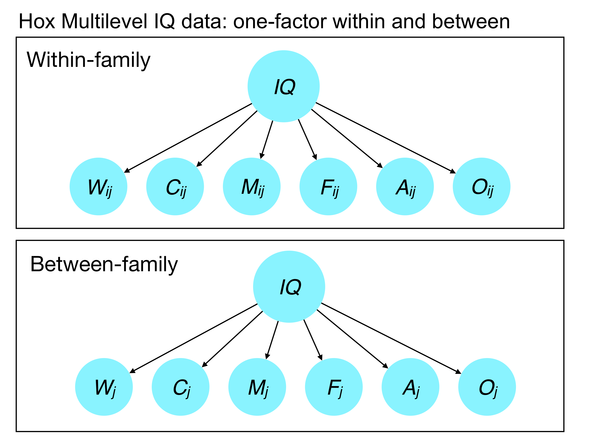
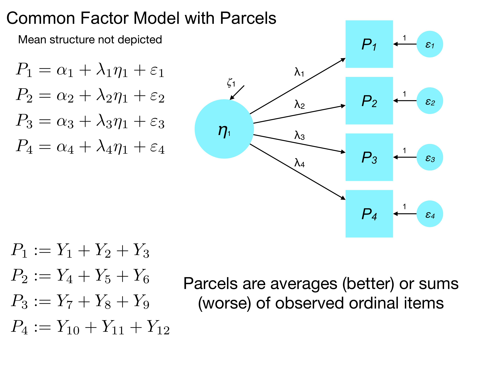

<style type="text/css">
body{ font-size: 24px; max-width: 1600px; margin: auto; padding: 1em; }
code.r{ font-size: 20px; }
p { padding-top: 8px; padding-bottom: 8px; }
pre { font-size: 16px; }
ol li:last-child { margin-bottom: 1.4em; }
ol li:first-child { margin-top: 1.4em; }
ol li { margin-top: 0.2em; margin-bottom: 0.2em; }
</style>
  
  
```{r setup, include=FALSE}
if (!require(pacman)) { install.packages("pacman"); library(pacman) }
p_load(knitr, tidyverse, viridis, lavaan, semPlot, psych, semTools, readr, GGally)
knitr::opts_chunk$set(echo = TRUE) #print code by default
options(digits=3)
set.seed(15092) #to make simulated data the same across computers
```

# Natalia

## Measurement invariance against a validated measure

**Question**: "Regarding measurement invariance, can you say more about how to conduct measurement invariance when the comparison group is the original validated measure? For example, if in my study, I am trying use a previously validated construct that is validated in a US sample, and using it for the first time in an Indian population, what are the guidelines for demonstrating measurement invariance here? We discussed model comparisons in the context of our own data (e.g., in a scenario where we have data from US and Indian populations) but not in the context of when we only have one of those (e.g., non-validated sample = Indian) and want to compare to previously validated samples that we did not collect, but that are available in the literature."

**Answer**: If you have the original mean and covariance matrix, as well as the sample size, from the published paper, you may be able to hack together something workable. Remember that SEM models a mean vector and covariance matrix as its target. You can provide a covariance matrix to `lavaan` as an input.

```{r}
#Brown book, Chapter 5

#input: the lower part of a correlation matrix, see p.169, Table 5.2 (the lisrel syntax)
cormat <- '
1.000
0.300 1.000
0.229 0.261 1.000
0.411 0.406 0.429 1.000
0.172 0.252 0.218 0.481 1.000
0.214 0.268 0.267 0.579 0.484 1.000
0.200 0.214 0.241 0.543 0.426 0.492 1.000
0.185 0.230 0.185 0.545 0.463 0.548 0.522 1.000
0.134 0.146 0.108 0.186 0.122 0.131 0.108 0.151 1.000
0.134 0.099 0.061 0.223 0.133 0.188 0.105 0.170 0.448 1.000
0.160 0.131 0.158 0.161 0.044 0.124 0.066 0.061 0.370 0.350 1.000
0.087 0.088 0.101 0.198 0.077 0.177 0.128 0.112 0.356 0.359 0.507 1.000'

#convert it to a square matrix
Cmat <- getCov(cormat)

# the standard deviations of the variables (Table 5.2)
neodat.sdev = c(2.06, 1.52, 1.92, 1.41, 1.73, 1.77, 2.49, 2.27, 2.68, 1.75, 2.57, 2.66)

# convert the correlation matrix to a covariance matrix (lavaan needs a covariance matrix as input)
covmat <- lavaan::cor2cov(Cmat, sds=neodat.sdev)

# assign row and column names to the covariance matrix
rownames(covmat) = c("X1","X2","X3","X4","X5","X6","X7","X8","X9","X10","X11","X12")
colnames(covmat)=rownames(covmat)               

#model set up - this is the model presented in Figure 1, p.168 
# you can play around with this model following the text of Ch.5
new.model <- '#X4 loads on both coping and social factors
              coping =~ X1 + X2 + X3 + X4   
              social =~ X5 + X6 + X7 + X8 + X4
              enhance =~ X9 + X10 + X11 + X12
              # residual correlation
              X11 ~~ X12'

#model fit
fit <- cfa(new.model, sample.cov=covmat, sample.nobs=500)
summary(fit)
```

The downside of this approach is that you cannot look at higher moments of the data that can affect fit. In particular, information about skewness and kurtosis is lost when we fit a model based on a mean (first moment) and variance (second moment) structure. Thus, the use of MLR to help adjust our test statistics for non-normality cannot help us.

An alternative, and probably the better approach in general, is to contact the authors of the published paper to ask if they would share the data for this purpose. They may wish to be co-author on the paper, which is up for discussion. But in the era of open science, people are increasingly willing to share their data without insisting upon authorship.

## Longitudinal and multilevel analysis

**Question:** "I am interested in learning more about how to apply SEM in a longitudinal multilevel context. For example, in a daily diary cross-lag panel design. What are the advantages to using SEM for these types of studies as compared to regular multilevel?"

**Answer**: The main advantage of SEM for multilevel questions is that it allows you to look at latent variables in nested data (e.g., longitudinal). Just as in GLM, if we have nested observations and do not account for this, our test statistics will be invalid.

Many multilevel models can be fit as-is within an SEM framework -- that is, SEM software supports models that are truly the same as in the multilevel case using the `lme4` or `nlme` packages. This means that if you are more comfortable thinking in SEM terms, it may be to your advantage to stay within `lavaan` or `Mplus` solely for consistency in representation.

The other main advantage of multilevel is that it uses latent decomposition to dissect a so-called 'level 1' variable (lower level) into between- versus within-cluster components. In MLM, this dissection is on your shoulders, usually requiring you to within-cluster center an L1 variable and also enter cluster means as an L2 predictor. Without parceling the L1 variable, your coefficients will represent the total effect, which combines between- and within-cluster effects. This is an often overlooked step in MLM that can drastically alter interpretations -- people often assume that a significant effect of an L1 variable represents a within-cluster (e.g., within-person) effect. But this need not be the case. Read: Curran & Bauer (2011), *Annual Review of Psychology* for information about disaggregating variance across levels.

For reasons that go beyond this class, MSEM provides a more accurate parceling of variance between the levels. At the between-person level, L1 (within) variables are treated as latent factors that capture the person/cluster tendencies in the L1 process.



# Blake

## Good paper example

"I'm interested in exploring a good example of a paper that uses SEM. We've learned several steps in SEM process, and I'm wondering what the norm is in how much you report in the paper. Are there tests you run, but don't actually report in the paper?"

This paper from Rogier Kievit has a reasonably good level of detail in terms of explaining the models and results: https://www.ncbi.nlm.nih.gov/pmc/articles/PMC5641983/

## Comparisons among methods

"It's also to the point where I've now learned several methods techniques (e.g., regression, MLM, growth modeling, SEM), and I'm now starting to wonder how they're all connected. And I agree with Natalia - it would be cool to discuss some longitudinal aspects."

And Griselda: "Like Blake and Natalia, I am also interested in learning more about longitudinal SEM and the connection between the different statistical methods that Blake has mentioned."

Let's discuss!

# Shane

**Question:** "I'd be interested in having a brief discussion about how to conceptualize hypotheses and alternative models before going into the model testing. I told Cynthia what I'm doing for my project and she said I should be anticipating a different relationship between my latent variables. I said no you're wrong. But now I'm stuck between two different (not necessarily opposed, but conflicting) primary hypotheses. I also anticipate playing around a little bit with factor loadings, especially because I have a lot of item level data for some of the factors, but only a few loadings for other factors. So conceptually, there's not much room for movement on some of my factors, but lots of room to remove or rearrange exogenous variables for other factors (I'm especially torn between using established questionnaire subscales that don't exactly reflect what I want versus creating my own latent factor from questions I select, just based on my own hypothesis)."

Overall, this sounds like a case of building different SEM models to test different hypotheses, but let's discuss!

# Sarah

**Question:** "I was hoping we could talk more about some useful visualization tools in R, including scatterplots for several variables (as many as five). It seems like ggplot2 is a good package, but I'm not sure how best to use it."

You can get Hadley Wickham's *ggplot2: Elegant graphics for data analysis* (2nd ed.) for free from our library: http://link.springer.com.ezaccess.libraries.psu.edu/book/10.1007%2F978-3-319-24277-4

And you can also access his book *R for Data Science* here: https://r4ds.had.co.nz

For scatterplot matrices in R using ggplot, I would recommend the `ggpairs` function in the `GGally` package. Here's an example:

```{r, fig=TRUE, fig.height=6, fig.width=6}
data(diamonds, package="ggplot2")
ggpairs(diamonds %>% select(carat, depth, price))
```

This function is sensitive to the data structure for each variable, so it will adapt the plot for nominal and ordinal data. For example, for nominal data, you'll get a bar plot that shows a graphical depiction of the corresponding contingency table.

```{r, fig=TRUE, fig.height=8, fig.width=6}
ggpairs(diamonds %>% select(color, clarity))
```

# Griselda

## Parceling

**Question**: "I am interested in learning more about parceling. In what context is parceling used and is this a recommended strategy?"

Parceling is a technique in which a set of ordinal or binary items are averaged or summed to produce a new item. Each parcel should consist of items that are very similar in content and that tap into the same basic construct.



Parcels are usually treated as continuous items in the factor model and usually have better reliabilities than the individual items alone (because we are combining information that is alike).

**Advantages of parceling**

1. If you have a huge number of items, this can help with aggregation and avoiding excessively complex factor models.
2. If you have a small sample, parceling can help you analyze a test with many items that would otherwise be tricky in terms of the cases:parameters ratio.

**Problems with parceling**

1. It's hard to know how to parcel. You could split randomly, or use rational decisions based on content. But different parcels may yield different results.
2. You should not use parceling if you want to know if a test is unidimensional (one factor). Parceling can mask multidimensionality.

**Take home**

Overall, if you have ordinal data and a large sample size, you're better off using a threshold model in which the thresholds are estimated as part of the SEM for each item. But if you are pressed for sample size or have many indicators to contend with, parceling may help.

## Count data

**Question:**: "I am also wondering if we can talk about the use of count data in SEM models. If the count variables are not severely skewed based on the threshold provided by Kline, then is it ok to use ML as the estimator? If the count data does present a normality issue, then what would be the best estimator to use when you have this type of data in your model?"

**Answer:** 

There are a few challenges with count data.

1. Is the univariate distribution approximately normal? Count data are often strongly positively skewed, especially when there are only a few response options.
2. Are there enough interval levels (counts) to treat the item as continuous? Remember the < 5 anchors rule for using categorical thresholds in the model.
3. Are the data highly overdispersed? In addition to positive skew, the SD of a count is often far greater than its mean. This can contribute to problems with kurtosis if the data are treated as normal.

Although this is not supported in `lavaan` yet, in Mplus, we can use alternative statistical distributions to capture count variables. In particular, Mplus supports Poisson-distributed outcomes.

```{r}
x <- 0:16
pdf <- dpois(x, lambda=6)
df <- data.frame(x=x, dens=pdf)
ggplot(df, aes(x=x, y=dens)) + geom_bar(stat = "identity") + ylab("density") + xlab("Count") + ggtitle("mean = 6, sd = sqrt(6)")

pdf <- dpois(x, lambda=2)
df <- data.frame(x=x, dens=pdf)
ggplot(df, aes(x=x, y=dens)) + geom_bar(stat = "identity") + ylab("density") + xlab("Count") + ggtitle("mean = 2, sd = sqrt(2)")
```

The Poisson distribution is a discrete probability distribution that captures counts, often with an emphasis on the rate at which an event occurs in a given interval of time. This distrubution is controlled by a single parameter, $\lambda$ that determines both the mean and the variance:

$$
\begin{align*}
M &= \lambda \\
SD &= \sqrt{\lambda}
\end{align*}
$$

At higher values of $\lambda$, the Poisson distribution is well approximated by a Gaussian (normal) distribution. Thus, if your counts are high, the distribution may look reasonably normal and a normal assumption on the variable may hold.

But if you have a low mean, or a high level of dispersion in the counts, modeling a variable as Poisson is good. Moreover, if the variance is far larger than the mean, you may need the *negative binomial* distribution, which extends a Poisson by allowing the variance to be more dispersed (larger) than in the Poisson.

There are examples of treating variables as counts (Poisson or negative binomial) in the Mplus User's Guide if you go down this path.
